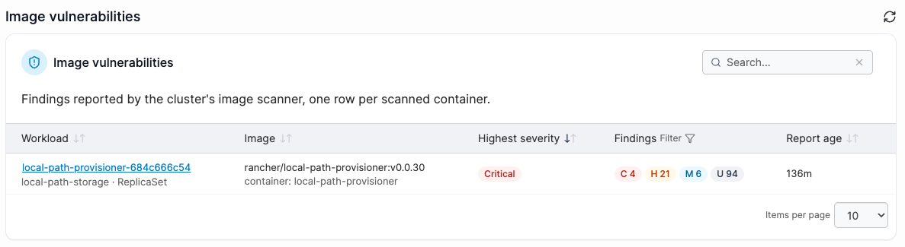
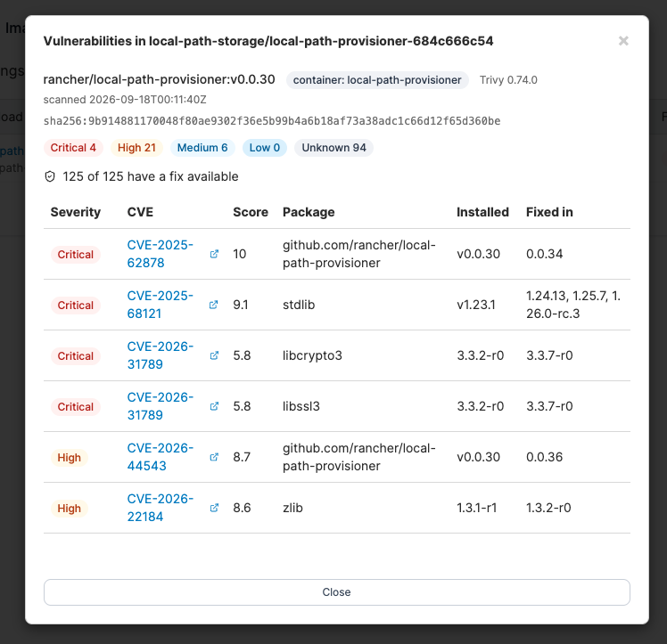

# Image Vulnerabilities


Reading Image Vulnerability findings is available to admin users only.


The **Image vulnerabilities** page becomes available once a [Vulnerability scanning policy](../../../admin/environments/policies/kubernetes-policies/create-a-kubernetes-vulnerability-scanning-policy.md) has been set up. It lists the container images running in your Kubernetes environment, together with the vulnerabilities found. Each row is one scanned container, sorted most severe first.

The page reads the `VulnerabilityReport` resources that trivy-operator writes to the cluster - it does not scan on demand. If the policy has just been applied, the list is empty until the first scan completes.

<figure><figcaption></figcaption></figure>

### Viewing vulnerability details 

Select a workload's name to open its vulnerability details. A workload with more than one container shows one section per container, since trivy-operator scans and reports on each container separately.

Each section shows:

* The image repository and tag, and its digest
* The scanner name and version, and when the report was last updated
* A count of findings for each severity
* How many of the findings have a fix available
* A table of every finding, with:

| Column    | Overview                                                                             |
| --------- | ------------------------------------------------------------------------------------ |
| Severity  | The finding's severity.                                                              |
| CVE       | The vulnerability ID, linking out to its advisory when one is available.             |
| Score     | The CVSS base score, where the scanner reports one.                                  |
| Package   | The affected package inside the image.                                               |
| Installed | The installed version of that package.                                               |
| Fixed in  | The version that resolves the finding, or **no fix** if none has been published yet. |

<figure><figcaption></figcaption></figure>

Select **Close** to return to the findings list.

### Permissions and troubleshooting

Reading findings requires read access to trivy-operator's `aquasecurity.github.io` custom resources in the scanned namespaces. This is admin-only.

| Message                               | Cause                                                                                                                                                           |
| ------------------------------------- | --------------------------------------------------------------------------------------------------------------------------------------------------------------- |
| Vulnerability scanning is not enabled | No vulnerability scanning policy is applied to this environment. Attach one to an environment group the environment belongs to.                                 |
| Unable to read vulnerability reports  | The environment has no scanner reports yet, or the signed-in user lacks read access to the `aquasecurity.github.io` resources trivy-operator writes reports as. |
