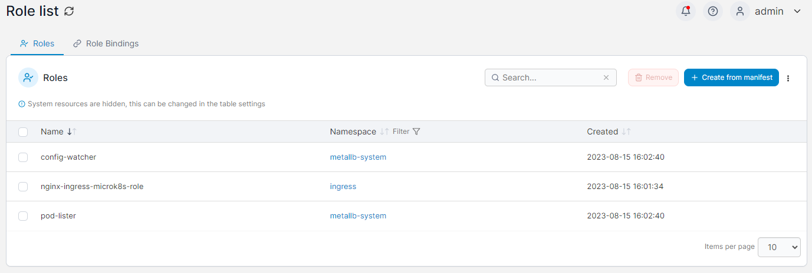
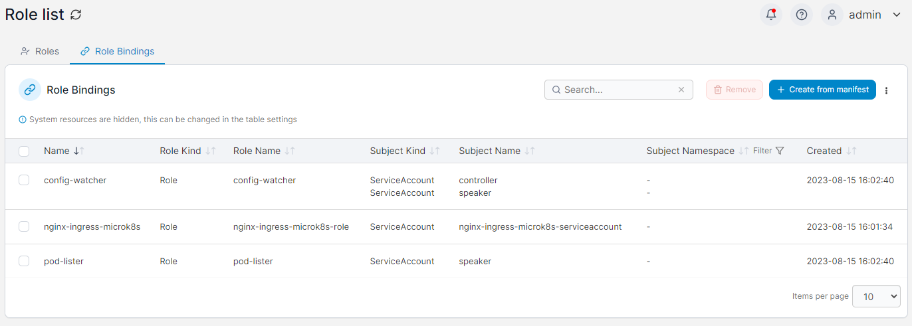

# Roles

This section lists the Roles and Role Bindings on your Kubernetes cluster. New Roles and Role Bindings can be created via the **Create from manifest** button.

Select the relevant tab to switch between Roles and Role Bindings.

## Roles

The list of Roles can be filtered by namespace. To remove a Role, check the box next to the Role you want to remove then click the **Remove** button.

<figure><figcaption></figcaption></figure>

## Role Bindings

The list of Role Bindings can be filtered by subject namespace and lists the **Name**, **Role Kind**, **Role Name**, **Subject Kind**, **Subject Name**, **Subject Namespace** and **Created** date. To remove a Role Binding, check the box next to the Role Binding you want to remove then click the **Remove** button.

<figure><figcaption></figcaption></figure>
