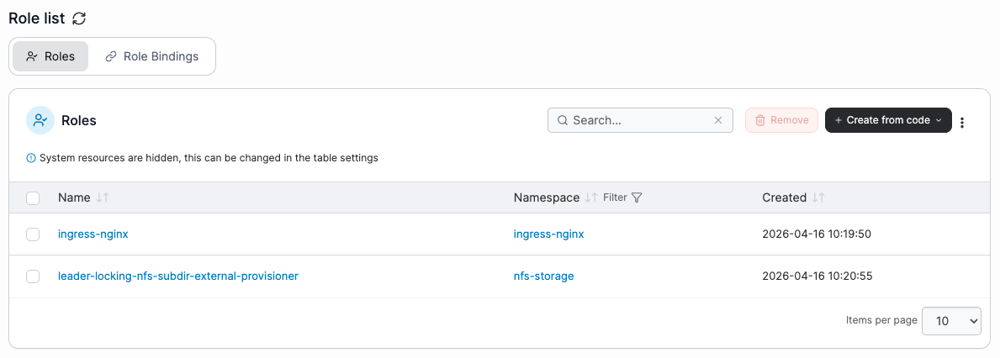
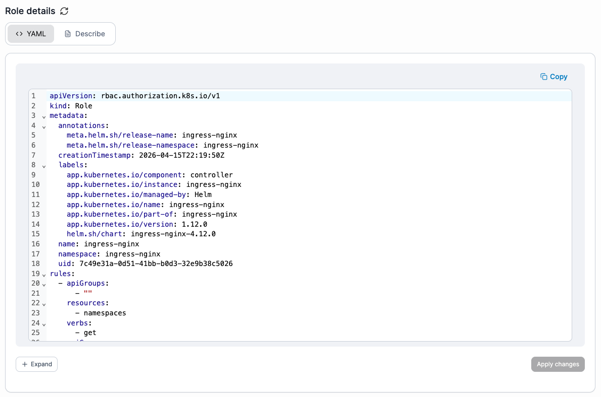
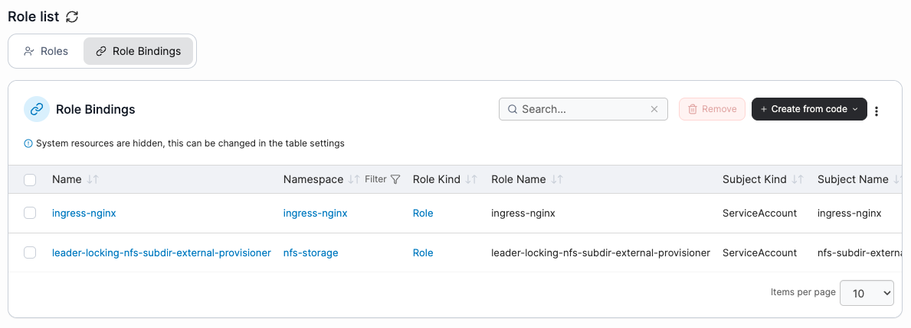
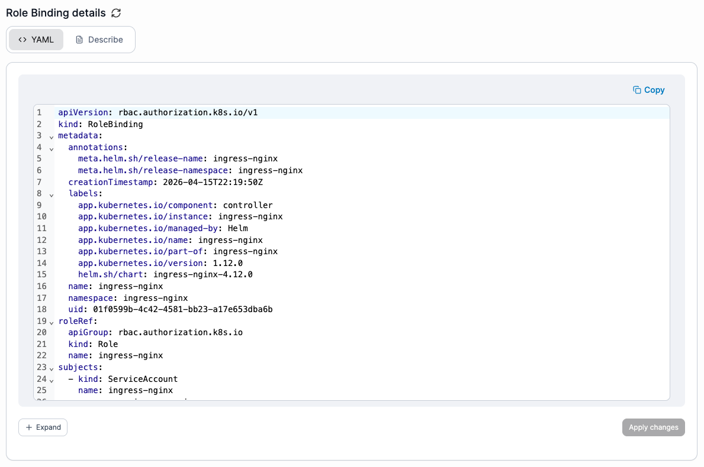

---
metaLinks:
  alternates:
    - >-
      https://app.gitbook.com/s/MdgxA76kWxcRmwybM8Ft/user/kubernetes/more-resources/namespace-roles
---

# Roles

This section lists the Roles and Role Bindings on your Kubernetes cluster. New Roles and Role Bindings can be created via the **Create from manifest** button.

Select the relevant tab to switch between Roles and Role Bindings.

## Roles

The list of Roles can be filtered by namespace.&#x20;

To remove a Role, check the box next to the Role you want to remove then click the **Remove** button.

<figure><figcaption></figcaption></figure>

Click the role **name** to open the role details page, where you can view the role description and edit the YAML.

To edit the role YAML, select the **YAML** tab and make your changes directly in the editor. Then select **Apply changes** in the bottom-right corner to patch the modified resources through the Kubernetes API. Any removed resources or unexpected changes to resources are ignored. Resources in namespaces marked as **system** cannot be edited.

To view details of the role, select the **Describe** tab.

<figure><figcaption></figcaption></figure>

## Role Bindings

The list of Role Bindings can be filtered by subject namespace and lists the **name**, **role kind**, **role name**, **subject kind**, **subject name**, **subject namespace** and **created** date.&#x20;

To remove a Role Binding, check the box next to the Role Binding you want to remove then click the **Remove** button.

<figure><figcaption></figcaption></figure>

Click the role binding **name** to open the role binding details page, where you can view the role binding description and edit the YAML.

To edit the role binding YAML, select the **YAML** tab and make your changes directly in the editor. Then select **Apply changes** in the bottom-right corner to patch the modified resources through the Kubernetes API. Any removed resources or unexpected changes to resources are ignored. Resources in namespaces marked as **system** cannot be edited.

To view details of the role binding, select the **Describe** tab.

<figure><figcaption></figcaption></figure>
