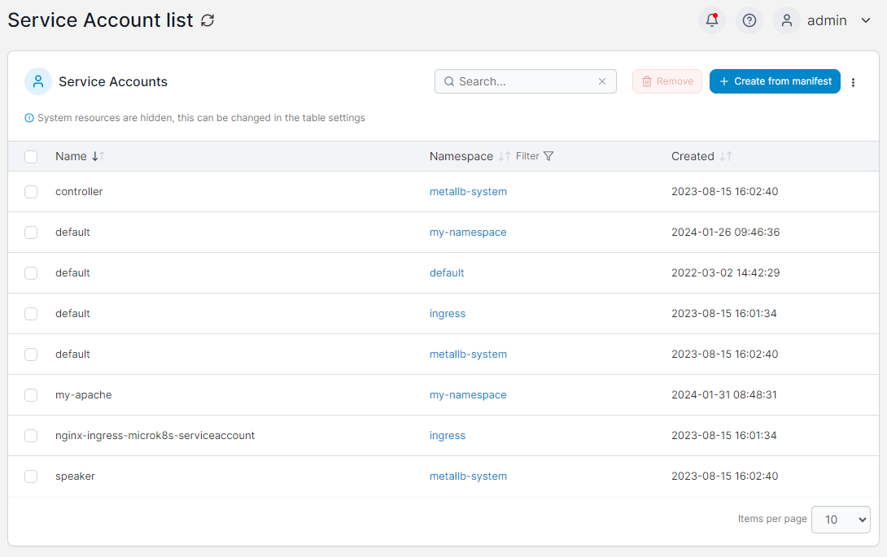

# Service Accounts

This section lists the Service Accounts on your Kubernetes cluster. The list can be filtered by namespace. You can create new Service Accounts via manifests by clicking **Create from Manifest**, and you can remove Service Accounts by checking the box next to the Service Account to remove and clicking **Remove**.

<figure><figcaption></figcaption></figure>
