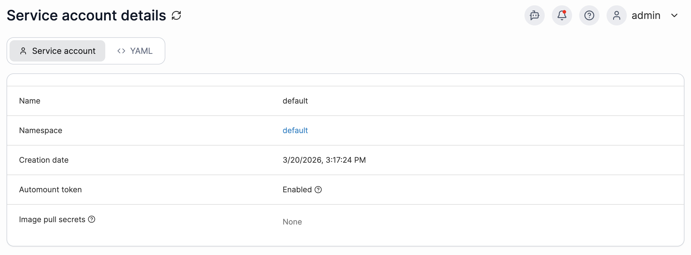

---
metaLinks:
  alternates:
    - >-
      https://app.gitbook.com/s/xdTQRpMuktD2l0URtOJO/user/kubernetes/more-resources/service-accounts
---

# Service Accounts

This section lists the Service Accounts on your Kubernetes cluster. The list can be filtered by namespace. You can create a new Service Accounts via a manifest or Helm chart by clicking **Create from code**. Remove Service Accounts by checking the box next to the Service Account and clicking **Remove**.

<figure><figcaption></figcaption></figure>

### Service Account details


Editing of Service Account details is disabled for resources in namespaces [marked as system](../namespaces/manage.md#actions).&#x20;


You can view the details of a Service Account by clicking its name from the Service Account list.

The **Service account** tab displays read-only details for the selected account. To modify the resource, switch to the **YAML** tab where you can edit the manifest directly. Once you have made your changes, click **Apply changes** in the bottom right.

<figure><figcaption></figcaption></figure>
