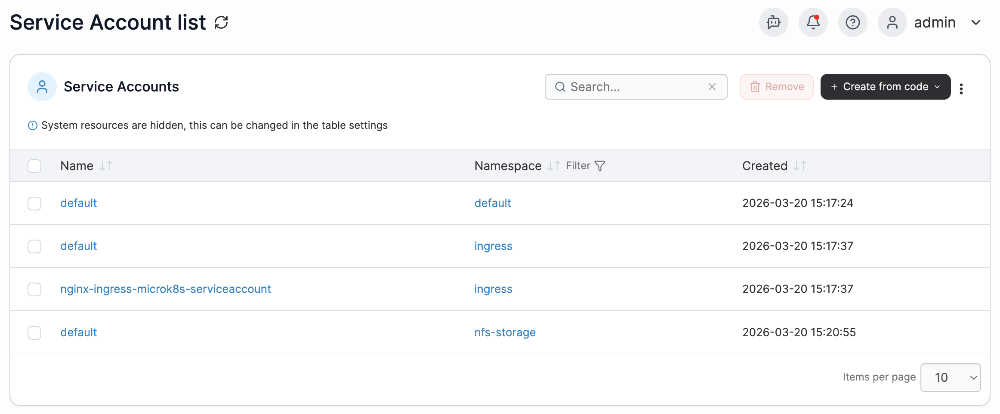
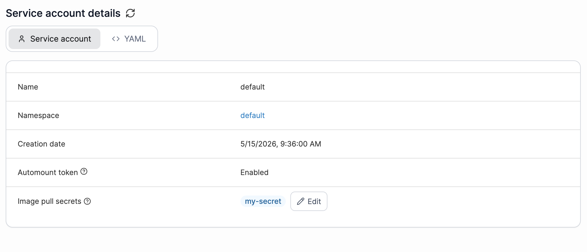

# Service Accounts

This section lists the Service Accounts on your Kubernetes cluster. The list can be filtered by namespace. You can create a new Service Accounts via a manifest or Helm chart by clicking **Create from code**. Remove Service Accounts by checking the box next to the Service Account and clicking **Remove**.

<figure><figcaption></figcaption></figure>

### Service Account details


Editing of Service Account details is disabled for resources in namespaces [marked as system](../namespaces/manage.md#actions).



When [registry access is added to a namespace](../cluster/registries.md#managing-access), Portainer creates a registry secret and adds it to the default Service Account as an imagePullSecret, allowing Pods in the namespace to pull images from the private registry automatically. When registry access is removed, Portainer deletes the registry secret and removes it from the default Service Account while retaining any other existing imagePullSecrets.


You can view the details of a Service Account by clicking its name from the Service Account list.

The **Service account** tab displays details for the selected account. From this view you can also directly add and remove your **Image pull secrets** by selecting the **Edit** button next to your secrets.

To modify the resource, switch to the **YAML** tab where you can edit the manifest directly. Once you have made your changes, click **Apply changes**.

<figure><figcaption></figcaption></figure>
