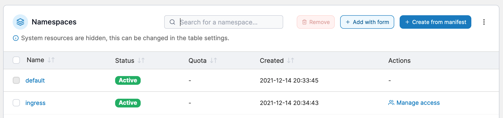

# Namespaces


Namespaces used to be called 'resource pools' prior to Portainer CE 2.6.0.


In Kubernetes, a single physical cluster can support multiple virtual clusters. These are known as namespaces.&#x20;

<figure><figcaption></figcaption></figure>

You can add, remove or manage namespaces in Portainer.


[add.md](add.md)



[manage.md](manage.md)



[access.md](access.md)



[remove.md](remove.md)

