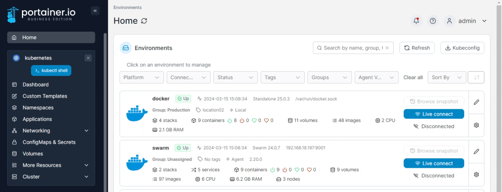
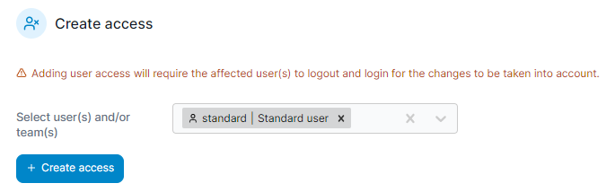

# Manage access to a namespace


Kubernetes role-based access control (RBAC) must be enabled and working before access control will work in Portainer.


From the menu select **Namespaces** then select **Manage access** on the same row as the namespace you want to manage.

<figure><figcaption></figcaption></figure>

Select the users/teams who will have access then click **Create access**.


Users or groups with cluster-wide roles (such as the Operator role) cannot be assigned to individual namespaces, as their cluster-wide nature applies to all namespaces in the environment.


<figure><figcaption></figcaption></figure>
