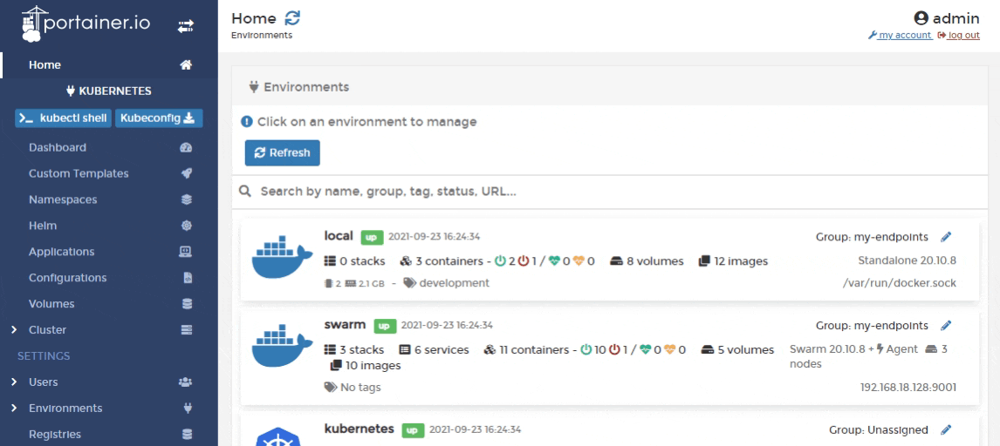
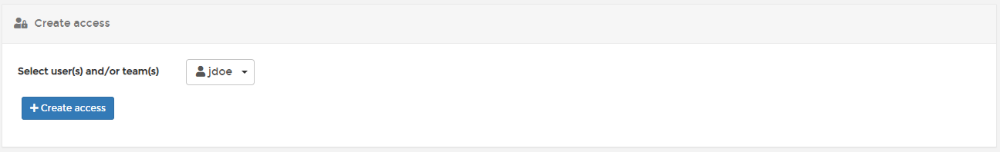

# Manage access to a namespace


Kubenetes role-based access control (RBAC) must be enabled and working before access control will work in Portainer.


From the menu select **Namespaces** then select **Manage access** on the same row as the namespace you want to manage.

Select the users/teams who will have access then click **Create access**.

