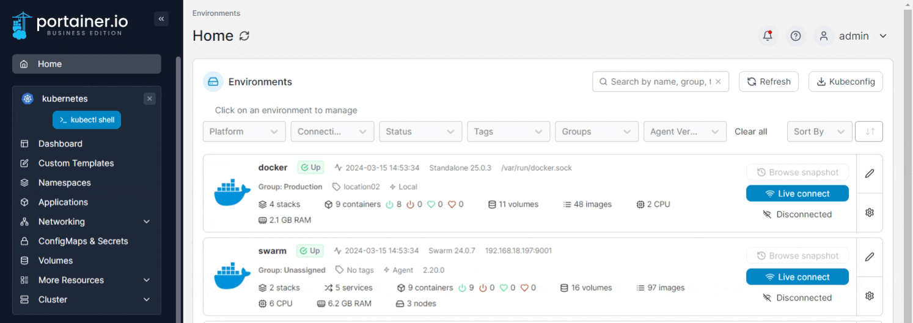
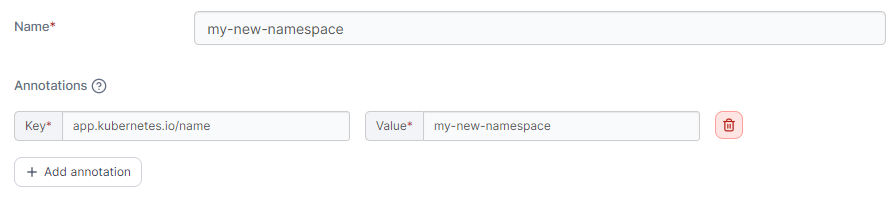
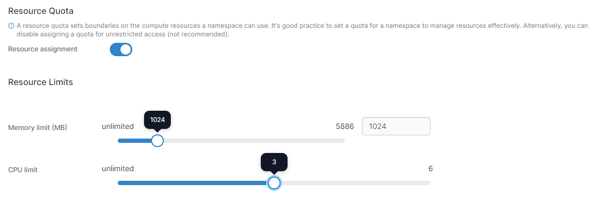
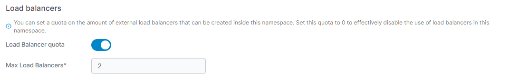
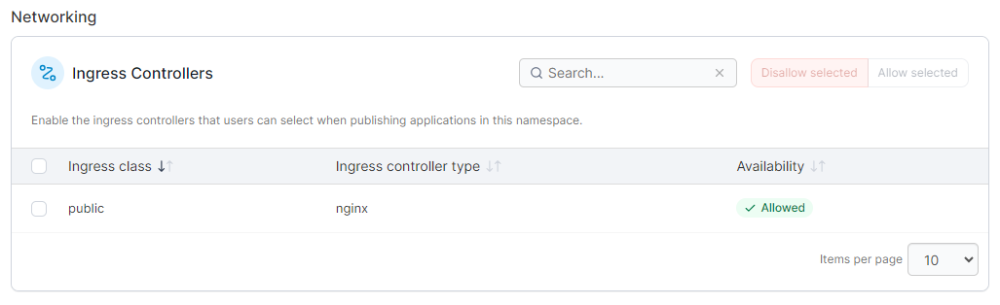
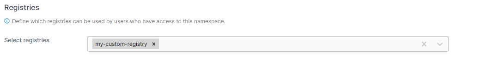
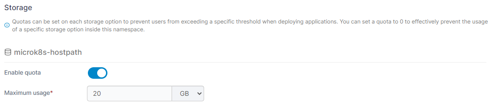
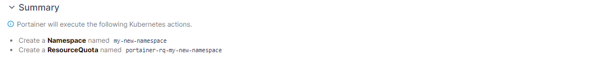

# Add a new namespace

From the menu select **Namespaces** then click **Add with form**.


Namespaces can also be added [using a manifest](../applications/manifest.md) by clicking **Create from manifest**.


<figure><figcaption></figcaption></figure>

Give the namespace a descriptive **name**. As an optional step you can add annotations to your namespace as required by clicking **Add annotation** and filling in the **Key** and **Value** fields.&#x20;

<figure><figcaption></figcaption></figure>

### Resource quota

You can assign a quota by toggling **Resource assignment** on, then setting resource limits like how much memory and CPU will be assigned.

<figure><figcaption></figcaption></figure>

### Load balancers

To set a maximum number of external load balancers that can be created inside the namespace, toggle on **Load Balancer quota** and set the **Max Load Balancers** number. If Load Balancer quota is enabled and the Max Load Balancers value is set to `0`, the use of external load balancers is effectively disabled in the namespace.


This section is only visible when **Allow users to use external load balancers** is enabled in the [Cluster Setup](../cluster/setup.md#allow-users-to-use-external-load-balancer).


<figure><figcaption></figcaption></figure>

### Networking - Ingresses

This section lets you define which ingress controllers are allowed to be used to publish applications within this namespace. Check the boxes next to the ingresses you want to allow and click **Allow selected**, or click **Disallow selected** to disallow their use in this namespace.


This section is only visible when **Configure ingress controller availability per namespace** is enabled in the [Cluster Setup](../cluster/setup.md#networking-ingresses).


<figure><figcaption></figcaption></figure>

### Registries

You can define the registries that are available within this namespace in this section. Select the registries from the **Select registries** dropdown to allow access.

<figure><figcaption></figcaption></figure>

### Storage

Use this section to enable quotas on your storage options for this namespace. To enable the use of quotas on a storage option, toggle **Enable quota** to on and set the **Maximum usage**. A Maximum usage value of `0` effectively prevents the usage of that storage option within the namespace.&#x20;

<figure><figcaption></figcaption></figure>

### Summary

This section displays a summary of the actions that will be taken when clicking the Add namespace button.&#x20;

<figure><figcaption></figcaption></figure>

When you're finished, click **Create namespace**.
