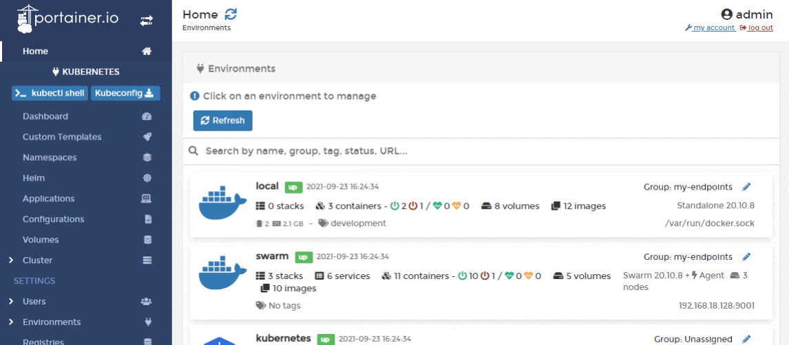
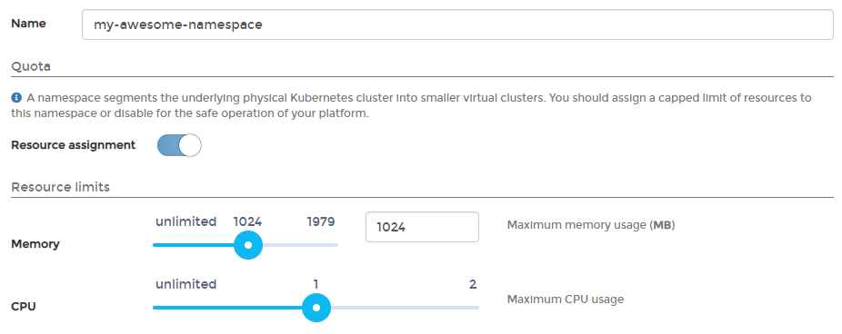

# Add a new namespace

From the menu select **Namespaces** then click **Add namespace with form**.


Namespaces can also be added [using a manifest](../applications/manifest.md) by clicking **Create from manifest**.


In the next screen, give the namespace a descriptive name. As an optional step you can assign a quota by toggling **Resource assignment** on, then setting resource limits like how much memory and CPU will be assigned.


Load balancer quota and storage quota functionality is only available in Portainer Business Edition.


When you're finished, click **Create namespace**.
