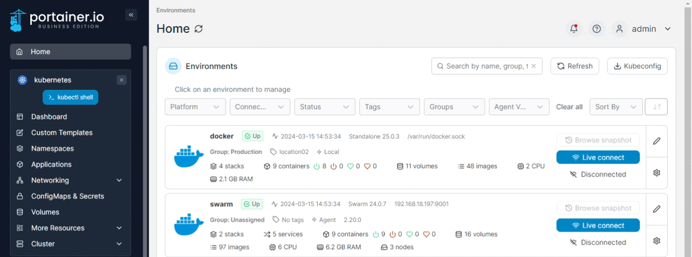
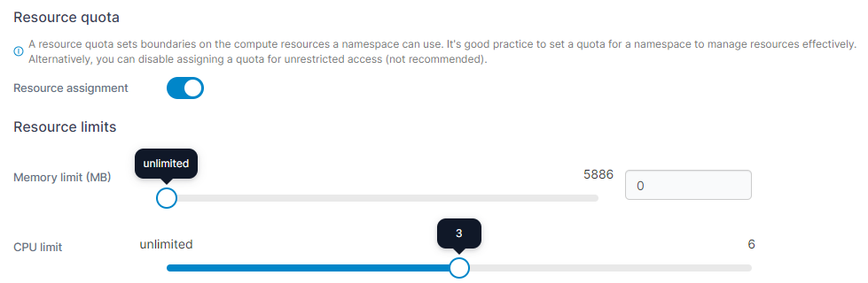
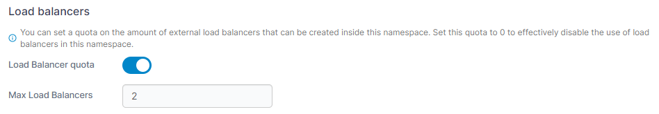
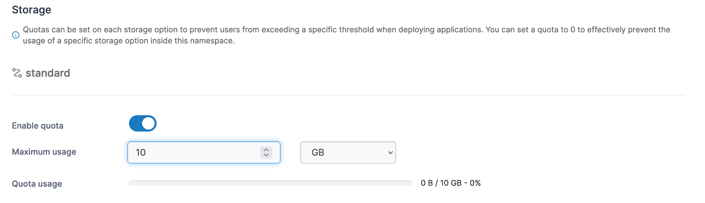
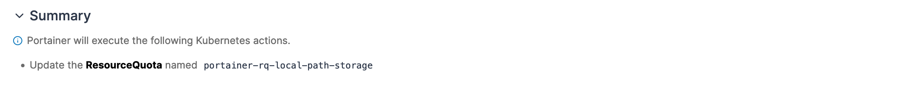
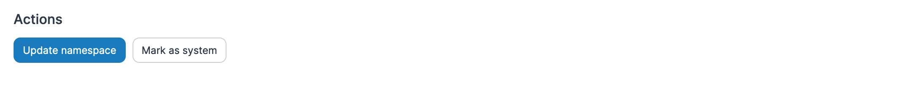

# Manage a namespace

From the menu select **Namespaces** then select the namespace you want to manage.

<figure><figcaption></figcaption></figure>

Here you can view details about the namespace and configure options specific to the namespace.

## Resource quota

Toggle on **Resource assignment** to enable quotas for this namespace, then define the memory and CPU limits.

<figure><figcaption></figcaption></figure>

## Load balancers

With this setting you can configure the amount of external load balancers that can be created in this namespace.&#x20;


This option only appears when **Allow users to use external load balancer** is enabled in the [cluster setup](../cluster/setup.md#allow-users-to-use-external-load-balancer).


<figure><figcaption></figcaption></figure>

## Networking

This section lets you define which ingress controllers are allowed to be used to publish applications within this namespace. Check the boxes next to the ingresses you want to allow and click **Allow selected**, or click **Disallow selected** to disallow their use in this namespace.


This section is only visible when **Configure ingress controller availability per namespace** is enabled in the [Cluster Setup](../cluster/setup.md#networking-ingresses).


<figure><figcaption></figcaption></figure>

## Registries

You can define the registries that are available within this namespace in this section. Select the registries from the **Select registries** dropdown to allow access.

<figure><figcaption></figcaption></figure>

## Storage

For each storage option available in the cluster, you can configure quotas for this namespace to limit usage.

<figure><figcaption></figcaption></figure>

## Summary

If you have made changes to the configuration, this section will list those changes.

<figure><figcaption></figcaption></figure>

## Actions

Once you have made the necessary changes, click **Update namespace**. Here you can also flag the namespace as a system namespace by clicking **Mark as system**.

<figure><figcaption></figcaption></figure>
