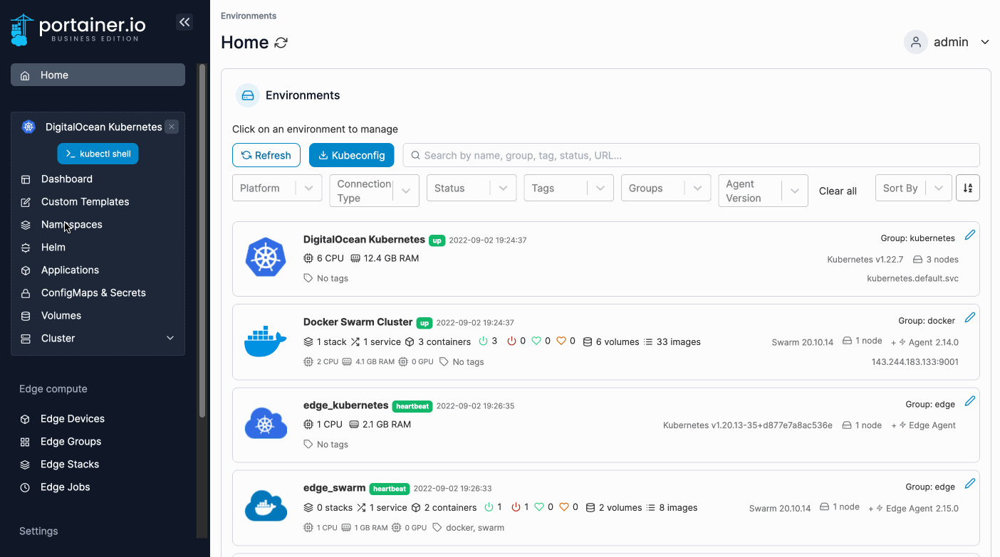
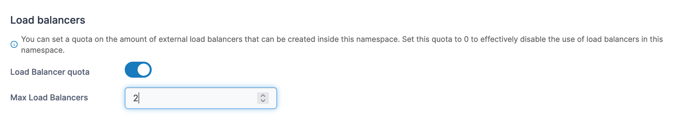
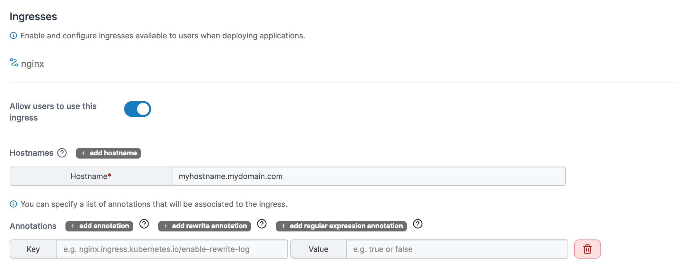

# Manage a namespace

From the menu select Namespaces then select the namespace you want to manage.

<figure><figcaption></figcaption></figure>

Here you can view details about the namespace and configure options specific to the namespace.

## Quota

Toggle on **Resource assignment** to enable quotas for this namespace, then define the memory and CPU limits.

<figure><figcaption></figcaption></figure>

## Load balancers

With this setting you can configure the amount of external load balancers that can be created in this namespace.&#x20;


This option only appears when **Allow users to use external load balancer** is enabled in the [cluster setup](../cluster/setup.md#allow-users-to-use-external-load-balancer).


<figure><figcaption></figcaption></figure>

## Storage

For each storage option available in the cluster, you can configure quotas for this namespace to limit usage.

<figure><figcaption></figcaption></figure>

## Ingresses

This section lists the available ingresses and whether they can be used by this namespace. For each namespace you can toggle on **Allow users to use this ingress**, then configure the ingress hostname, route redirection and advanced settings as needed.

<figure><figcaption></figcaption></figure>

## Summary

If you have made changes to the configuration, this section will list those changes.

<figure><figcaption></figcaption></figure>

## Actions

Once you have made the necessary changes, click **Update namespace**. Here you can also flag the namespace as a system namespace by clicking **Mark as system**.

<figure><figcaption></figcaption></figure>
