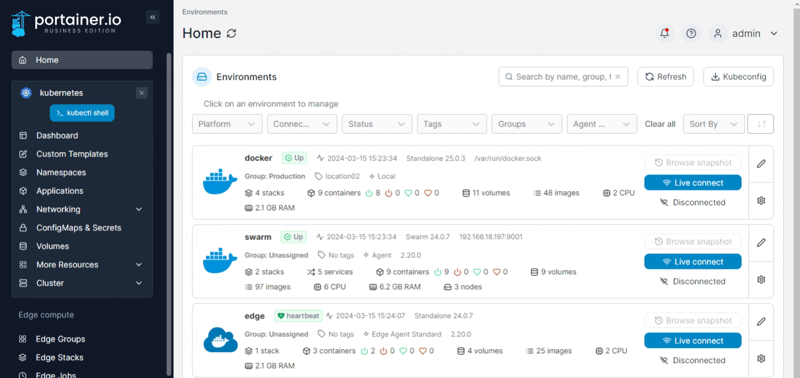
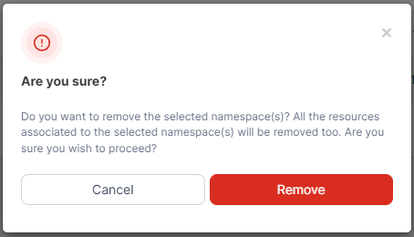

# Remove a namespace

From the menu select **Namespaces**, tick the checkbox next to the namespace then click **Remove**.

<figure><figcaption></figcaption></figure>

When the confirmation message appears, click **Remove**.

<figure><figcaption></figcaption></figure>

If a namespace is stuck in a terminating state, Portainer will ask if you want to force deletion of that namespace.
