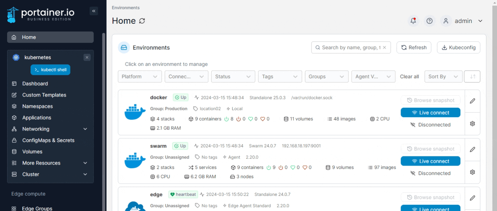
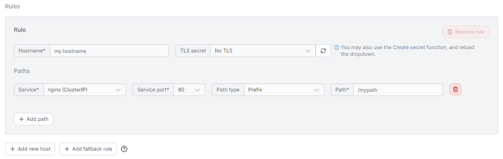

# Add an Ingress manually

From the menu expand **Networking**, select **Ingresses** then click **Add with form**.

<figure><figcaption></figcaption></figure>

Select the **namespace** that the Ingress needs to be created in from the list.

Complete the required information, using the sections below as a guide.

### Base Configuration

<table><thead><tr><th width="213">Field/Option</th><th>Overview</th><th data-hidden></th><th data-hidden></th></tr></thead><tbody><tr><td>Name</td><td>Enter a descriptive name for the ingress.</td><td></td><td></td></tr><tr><td>Ingress class</td><td>Select an Ingress Class object from the list, or select <strong>none</strong> when no <code>IngressClass</code> info is needed in the Ingress specification.</td><td></td><td></td></tr><tr><td>Annotations</td><td>You can add annotations to your ingress as required by clicking <strong>Add annotation</strong> and filling in the <strong>Key</strong> and <strong>Value</strong> fields. Depending on your selected ingress class you may also be able to add rewrite annotations and/or regular expression annotations.</td><td></td><td></td></tr></tbody></table>

<figure><figcaption></figcaption></figure>


**Note for Google Cloud users**

Google Cloud ingress controller (gce or GKE Ingress) continues to use the deprecated `kubernetes.io/ingress.class` annotation on ingresses, whereas most other ingress controllers use the `IngressClass` resource that was introduced in Kubernetes 1.18.

Portainer targets the `IngressClass` resource means of specifying ingress classes, but you can still use the Google Cloud ingress controllers by turning on the **Allow ingress class to be set to "none"** toggle in [Cluster setup](../../cluster/setup.md#ingress-controllers) and setting them up as custom with `none` selected as their **Ingress class**. Then when adding an ingress based on this, set an annotation with the **key** `kubernetes.io/ingress.class` and **value** `gce.`


### Ingress Rule

Here you can define the specifics for the Ingress rule:

<table><thead><tr><th width="201">Field/Option</th><th>Overview</th><th data-hidden></th></tr></thead><tbody><tr><td>Hostname</td><td>Enter the FQDN that the application should be accessed with eg: <code>myapp.mydomain.com</code>.</td><td></td></tr><tr><td>TLS Secret</td><td>Select the TLS secret that holds the SSL certificate information for the hostname entered above. Optionally, create a new <a href="../../configurations/add-1.md">TLS Secret</a> by clicking on the <strong>Create secret</strong> link (opens in a new tab). Once secret is created click on the reload button next to the TLS secret dropdown and select the new secret.</td><td></td></tr><tr><td>Service</td><td>Select a service that you want to expose from the list.</td><td></td></tr><tr><td>Service port</td><td>Select the port that needs to be exposed from the list.</td><td></td></tr><tr><td>Path type</td><td>Select the relevant path type. The default is <code>Prefix</code>.</td><td></td></tr><tr><td>Path</td><td>Enter the path to expose the application on. To expose on the root of the domain use <code>/</code>.</td><td></td></tr></tbody></table>

You can expose other services using a different path by clicking on **Add path**.

<figure><figcaption></figcaption></figure>

Add more rules by clicking on **Add new host** or a fallback rule by **Add fallback rule**.


A fallback rule has no host specified. This rule only applies when an inbound request has a hostname that does not match with any of your other rules.


When you're ready, click **Create**.
