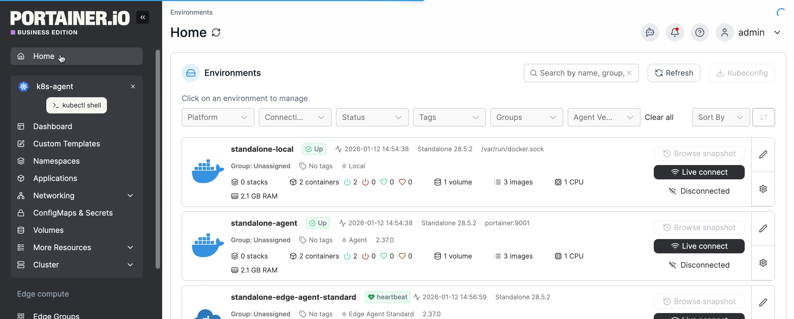

---
metaLinks:
  alternates:
    - >-
      https://app.gitbook.com/s/udjBY77rL45c6FTs07xf/user/kubernetes/networking/ingresses/manifest
---

# Add an Ingress using a manifest

There are two ways to add a new ingress: [manually by using a form](add.md) or automatically by using a manifest. This article explains how to add an ingress using a manifest.


Manifests aren't just for Ingresses - you can also deploy namespaces, ConfigMaps, secrets and volumes using a manifest.


From the menu expand **Networking**, select **Ingresses,** click **Create from code** and select **Manifest** from the drop down menu.

<figure><figcaption></figcaption></figure>

From here you can follow the link below for instructions on adding from a manifest.


[create.md](../../applications/manifest/create.md)

