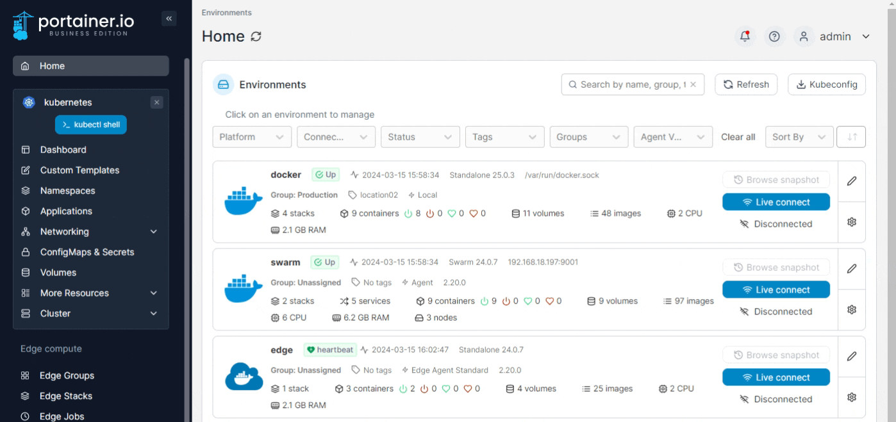

---
metaLinks:
  alternates:
    - >-
      https://app.gitbook.com/s/Dalese9Lv4CX6YKS1s45/user/kubernetes/networking/ingresses/remove-an-ingress
---

# Remove an Ingress

From the menu expand **Networking** and select **Ingress**, tick the checkbox next to the Ingress you want to remove then click **Remove**. Click **Remove** again to confirm.

<figure><figcaption></figcaption></figure>
