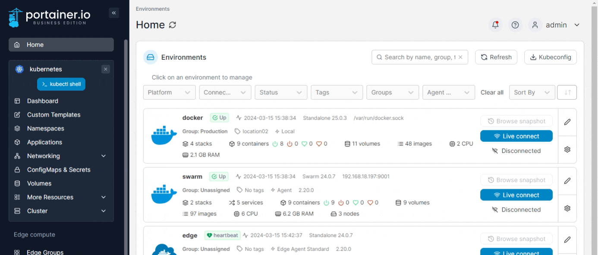
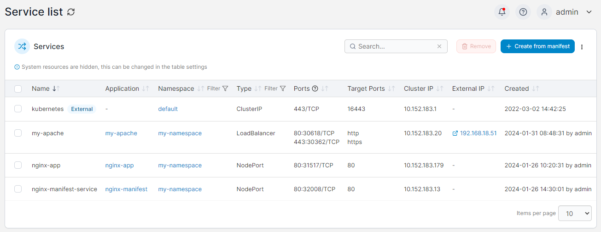

# Services

In Kubernetes, a **Service** is an object that is used to expose an application (running in pods) to a network.&#x20;

The Services page lists the services within your cluster, and provides detail on each service. To view the list of services, expand **Networking** and select **Services** from the left hand menu.

<figure><figcaption></figcaption></figure>

All the services the user has access to are listed on this page.

<figure><figcaption></figcaption></figure>

For each service, the list displays the **name** of the service, the **application** and **namespace** the service belongs to, the **type** of service, the exposed **ports** and **target ports**, the **cluster IP** and **external IP** (if any) and the **creation date** and **user** (if available). Services provisioned externally to Portainer are marked with the **external** label, and system services are marked with the **system** label.&#x20;


The display of system services can be toggled under the table settings (click the three dots at the top right of the table and tick **Show system resources**.

