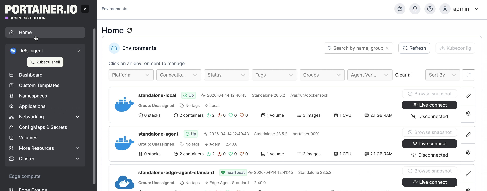
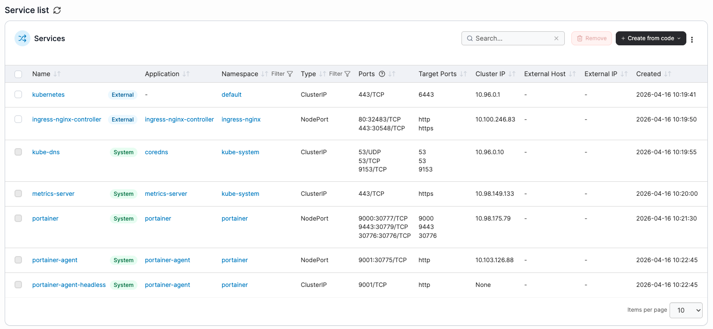
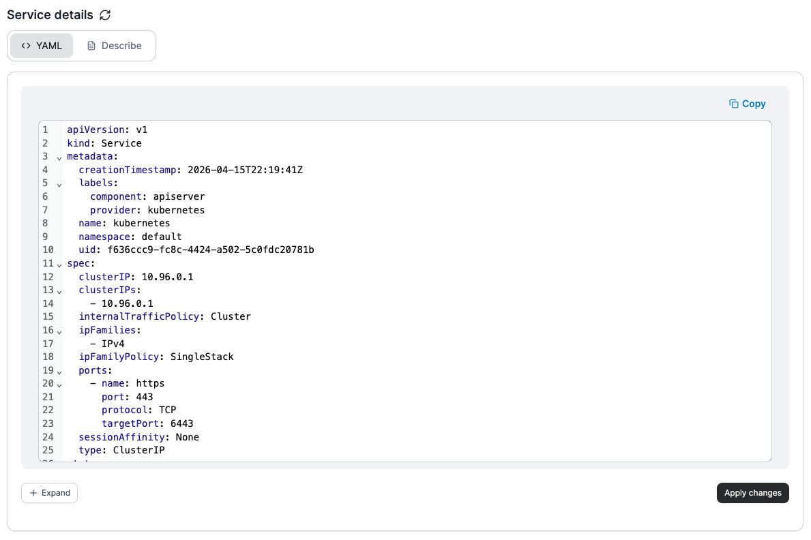

---
metaLinks:
  alternates:
    - >-
      https://app.gitbook.com/s/MdgxA76kWxcRmwybM8Ft/user/kubernetes/networking/services
---

# Services

In Kubernetes, a **Service** is an object that is used to expose an application (running in pods) to a network.&#x20;

The Services page lists the services within your cluster, and provides detail on each service. To view the list of services, expand **Networking** and select **Services** from the left hand menu.

<figure><figcaption></figcaption></figure>


The display of system services can be toggled under the table settings. Click the three dots at the top right of the table and tick **Show system resources**.


For each service, the list displays the service **name**, the **application** and **namespace** it belongs to, the service **type**, the exposed **ports** and **target ports**, the **cluster IP**, **external host** and **external IP** (if applicable), and the **creation date** and **user**, where available. Services provisioned outside of Portainer are marked with the **external** label, and system services are marked with the **system** label.

To remove a service, tick the checkbox next to the service you want to remove and click **Remove** in the top-right corner.&#x20;

<figure><figcaption></figcaption></figure>

Click the service **name** to open the service details page, where you can view the service details and edit the YAML.

To edit the service YAML, select the **YAML** tab and make your changes directly in the editor. Then select **Apply changes** in the bottom-right corner to patch the modified resources through the Kubernetes API. Any removed resources or unexpected changes to resources are ignored. Resources in namespaces marked as **system** cannot be edited.

To view service details, select the **Describe** tab.

<figure><figcaption></figcaption></figure>
