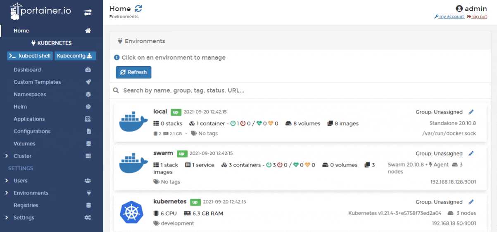

# Custom Templates

Portainer CE 2.9 adds custom template support for Kubernetes environments, allowing you to create templates based on Kubernetes manifests for future deployment.

From the menu select **Custom Templates** to view a list of custom templates you've already created.

You can create a new template.


[add.md](add.md)


You can also edit an existing template.


[edit.md](edit.md)


And, if you no longer need a custom template, you can simply remove it.


[remove.md](remove.md)

