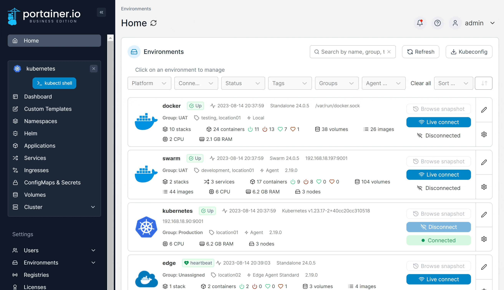
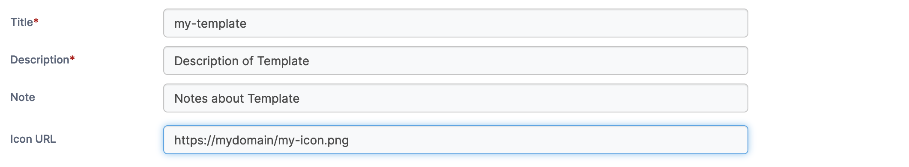
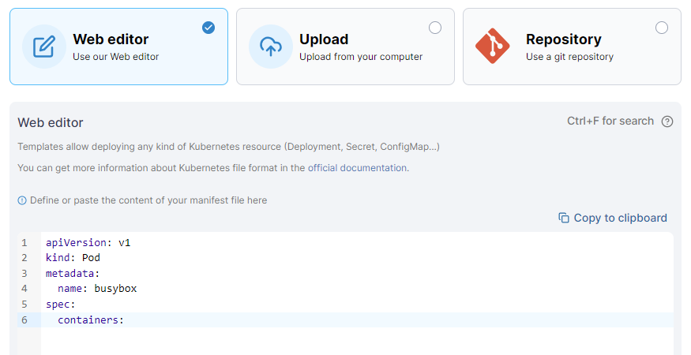
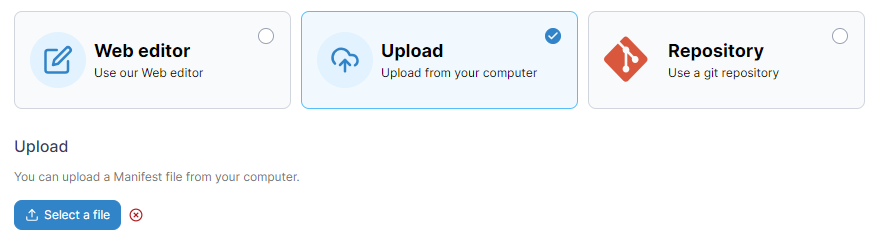
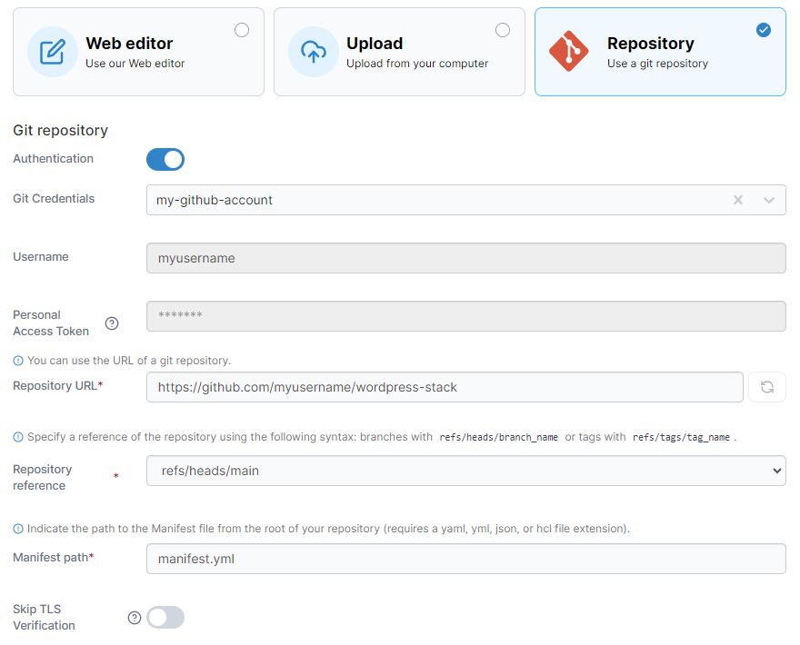
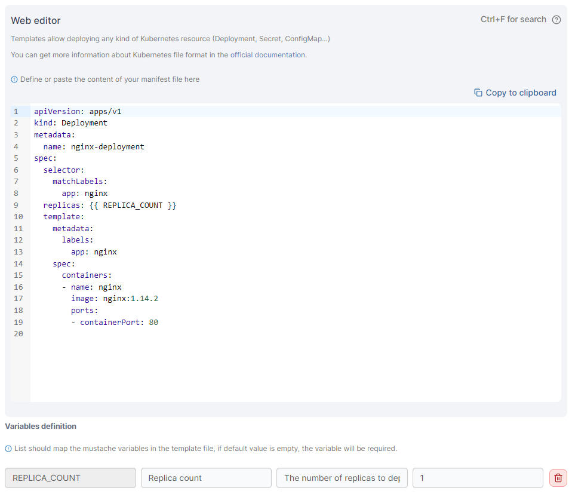
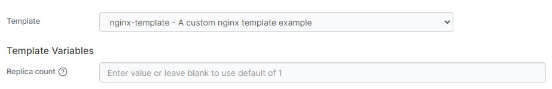

# Add a new custom template

## Creating the template

From the menu select **Custom Templates** then click **Add Custom Template**.

<figure><figcaption></figcaption></figure>

Complete the form, using the table below as a guide.

| Field/Option | Overview                                                                                         |
| ------------ | ------------------------------------------------------------------------------------------------ |
| Title        | Enter a title for your custom template. This is how the template will appear when it's deployed. |
| Description  | Enter a description of the template.                                                             |
| Note         | As an optional step, record some extra information about the template.                           |
| Icon URL     | Optionally, enter the URL to an image to use as an icon for the template.                        |

<figure><figcaption></figcaption></figure>

Next, select the **Build method**.

## Selecting the build method

### Method 1: Web editor

Define or paste the contents of your manifest file into the web editor. When deploying an application using a custom template you will be given an opportunity to edit the manifest before deployment.


You can search within the web editor at any time by pressing `Ctrl-F` (or `Cmd-F` on Mac).


<figure><figcaption></figcaption></figure>

When you're ready, click **Create custom template**.

### Method 2: Upload

If you have a manifest file locally, you can upload it directly to Portainer. Click **Select file** to browse to the file.

<figure><figcaption></figcaption></figure>

When you're ready, click **Create custom template**.

### Method 3: Repository

If you have a template in a Git repository, you can add it to your custom templates. Enter the required details for access to your Git repository.

| Field/Option          | Overview                                                                                                                                  |
| --------------------- | ----------------------------------------------------------------------------------------------------------------------------------------- |
| Authentication        | Toggle this option on if your repository requires authentication.                                                                         |
| Git credentials       | If you have credentials configured you can select the set to use from this dropdown.                                                      |
| Username              | Enter your Git username.                                                                                                                  |
| Personal access token | Enter your personal access token or password.                                                                                             |
| Repository URL        | Enter the URL to your Git repository.                                                                                                     |
| Repository reference  | Select the reference to use from your repository. This will be auto populated with available references from your repository.             |
| Manifest path         | Enter the path and filename of the manifest within your repository.                                                                       |
| Skip TLS Verification | Toggle this option on to skip TLS verification for the repository. This is useful if you are using self-signed certificates on your repo. |

<figure><figcaption></figcaption></figure>

When you're ready, click **Create custom template**.

## Variables in templates

Custom templates support the use of variables to provide further customization of the deployed stack. A stack can define a variable that can then be adjusted by the user at deployment.


This feature is only available in Portainer Business Edition.


Variables are identified in stacks with `{{ }}`. For example, the following stack provides a `REPLICA_COUNT` variable:

<figure><figcaption></figcaption></figure>

When a variable is defined, options appear to customize how the variable appears when deploying the stack. You can set the **label**, **description** and **default value**.

When a template is deployed, any variables that have been configured are editable:

<figure><figcaption></figcaption></figure>
