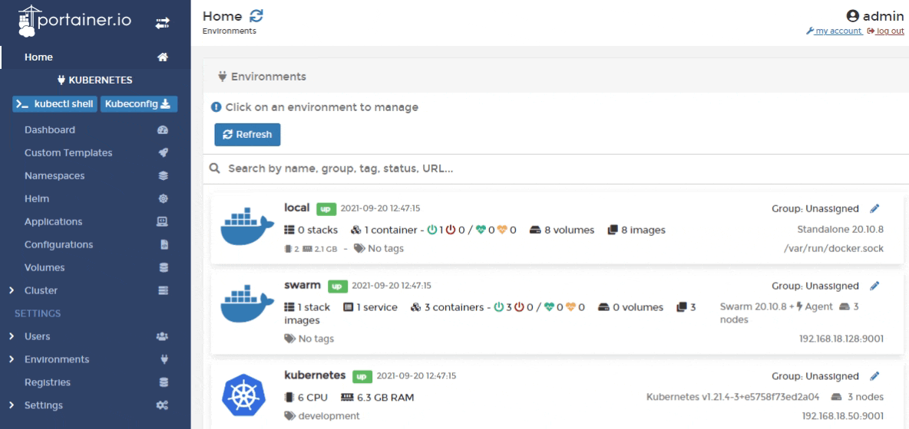
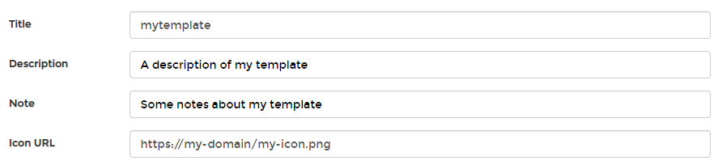
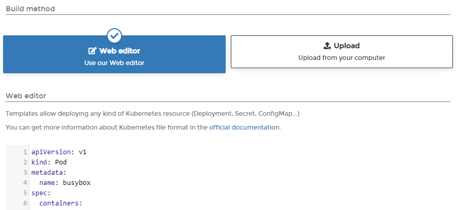
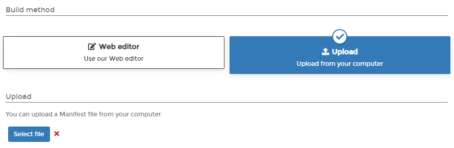

# Add a new custom template

## Creating the template

From the menu select **Custom Templates** then click **Add Custom Template**.

Complete the form, using the table below as a guide.

| Field/Option | Overview |
| :--- | :--- |
| Title | Enter a title for your custom template. This is how the template will appear when it's deployed. |
| Description | Enter a description of the template. |
| Note | As an optional step, record some extra information about the template. |
| Icon URL | Optionally, enter the URL to an image to use as an icon for the template. |

Next, select the **Build method**.

## Selecting the build method

### Method 1: Web editor

Define or paste the contents of your manifest file into the web editor. When deploying an application using a custom template you will be given an opportunity to edit the manifest before deployment.

When you're ready, click **Create custom template**.

### Method 2: Upload

If you have a manifest file locally, you can upload it directly to Portainer. Click **Select file** to browse to the file.

When you're ready, click **Create custom template**.

