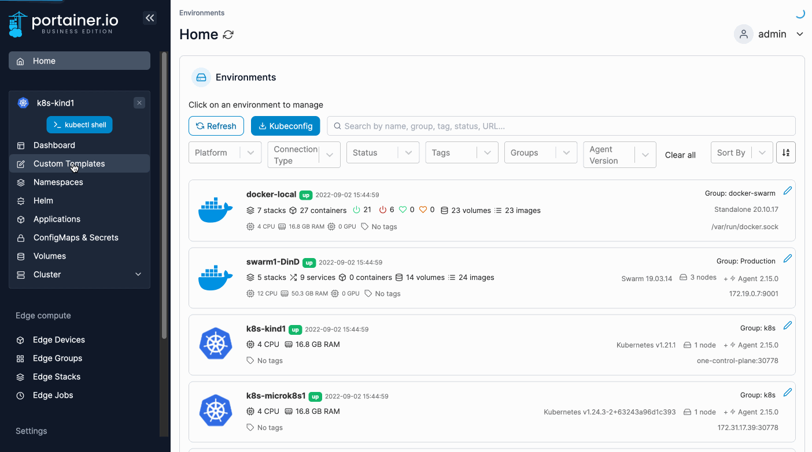

# Edit a custom template

From the menu select **Custom Templates** then click **Edit** next to the template you want to edit.

<figure><figcaption></figcaption></figure>


You can search within the web editor at any time by pressing `Ctrl-F` (or `Cmd-F` on Mac).


Make the required changes to the template then click **Update the template**.
