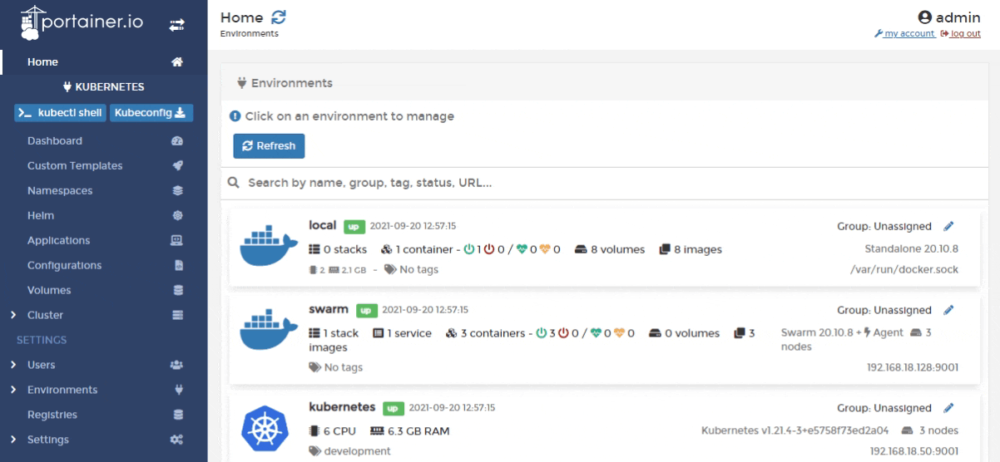

# Edit a custom template

From the menu select **Custom Templates** then click **Edit** next to the template you want to edit.

Make the required changes to the template then click **Update the template**.

