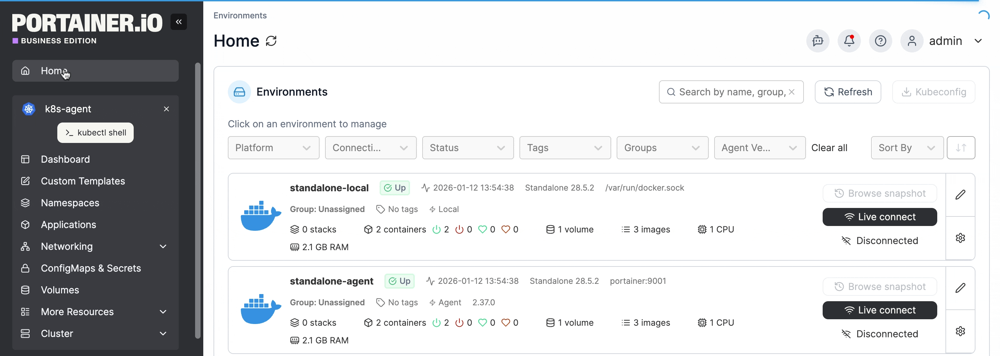
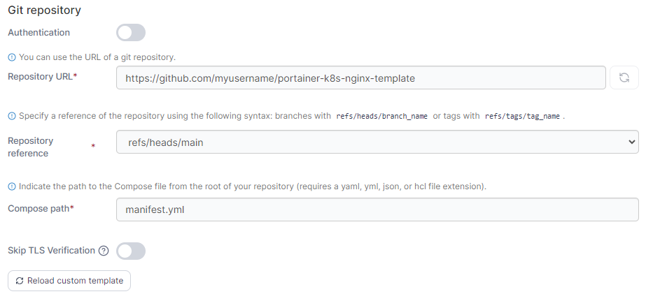

---
metaLinks:
  alternates:
    - >-
      https://app.gitbook.com/s/j6QEqM3Sd94bdPsX4HaN/user/kubernetes/templates/edit
---

# Edit a custom template

From the menu select **Custom Templates** then click **Edit** next to the template you want to edit.

<figure><figcaption></figcaption></figure>


You can search within the web editor at any time by pressing `Ctrl-F` (or `Cmd-F` on Mac).


If your template is deployed from a Git repository, you will have the option to edit the Git settings if required. You can also click **Reload custom template** to update the template from the remote repository.

<figure><figcaption></figcaption></figure>

Make the required changes to the template then click **Update the template**.
