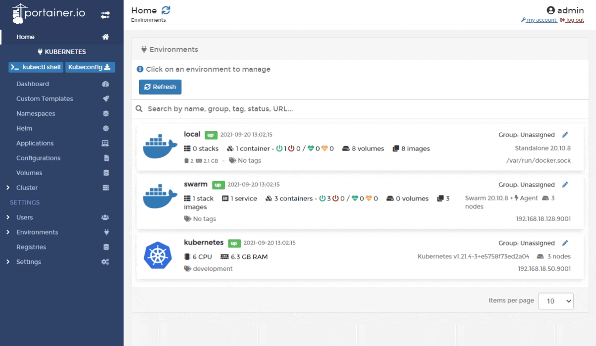
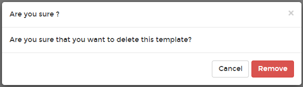

# Remove a custom template


Removing a custom template will not remove any deployments created using the template.


From the menu select **Custom Templates** then click **Delete** next to the template you want to remove.

When the confirmation message appears, click **Remove**.

