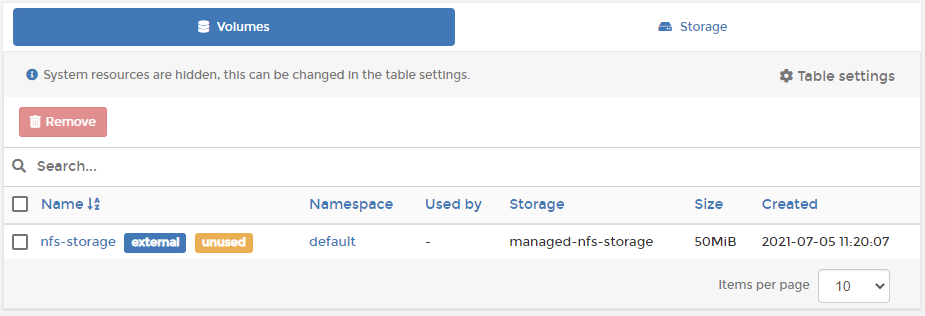

# Volumes

In Kubernetes, a volume is an abstraction of a file system that is available to applications. In Portainer you can manage the volumes that have been deployed by your applications within your cluster.





## Volumes tab

Lets you view information about the volumes that exist within the cluster, including:

* The namespace that each volume is a part of.
* Which applications use each volume.
* The storage class each volume belongs to.
* The size of each volume.
* When the volumes were created.
* Extra information tags: `external` \(the volume was configured externally\) and `unused` \(the volume is not currently in use\).

## Storage tab

The storage tab lists the storage classes available within your infrastructure along with the disk space used by each volume. Each storage class can be expanded to list the volumes contained within.

