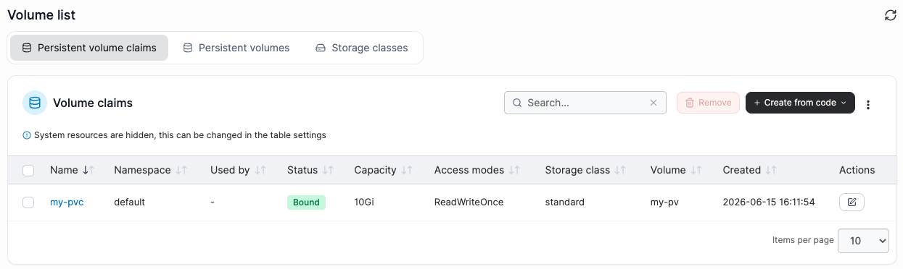
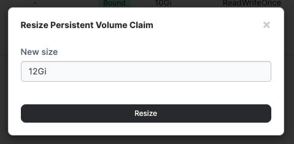
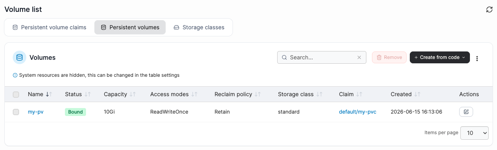
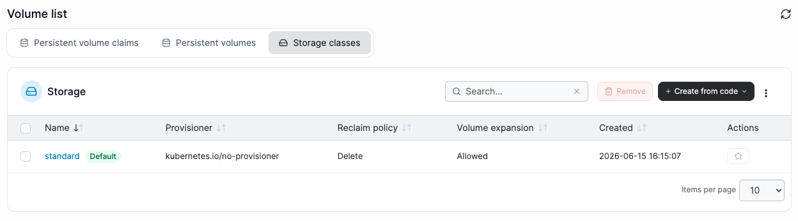

# Volumes

In Kubernetes, a volume is an abstraction of a file system made available to applications. In Portainer, you can manage the volumes deployed by your applications within your cluster.

Volumes and storage classes can be added [using a manifest](../applications/manifest/create.md) or a [helm chart](../applications/manifest/helm.md) by clicking **Create from code.**

## Persistent volume claims

Lists the persistent volume claims that exist within the cluster. To resize a persistent volume claim, select the edit icon in the **Actions** menu. Click the volume name to [view its details](inspect.md).

<figure><figcaption></figcaption></figure>

<figure><figcaption></figcaption></figure>

## Persistent volumes

Lists the persistent volumes that exist within the cluster. To edit the reclaim policy of a volume, select the edit icon in the **Actions** menu. Click the volume name to [view its details](inspect.md).

<figure><figcaption></figcaption></figure>

<figure><figcaption></figcaption></figure>

## Storage classes

Lists the storage classes available within your cluster. To set a storage class as the cluster default, select the star icon in the **Actions** menu. Click the storage class name to [view its details](inspect.md).

<figure><figcaption></figcaption></figure>


[inspect.md](inspect.md)



[remove.md](../../docker/volumes/remove.md)

