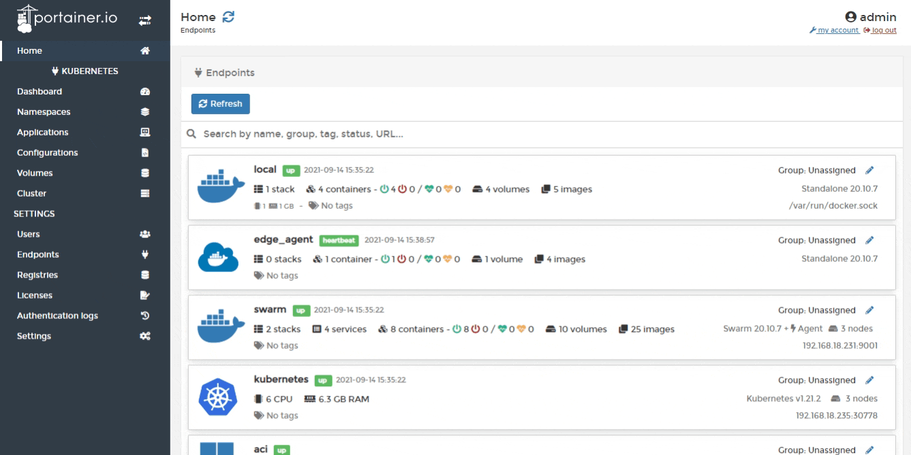
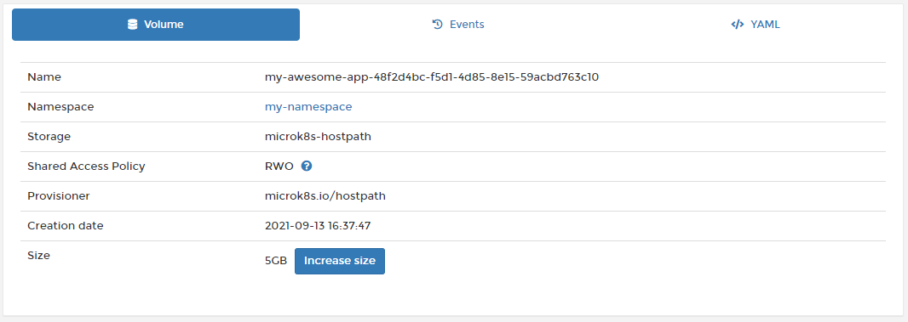
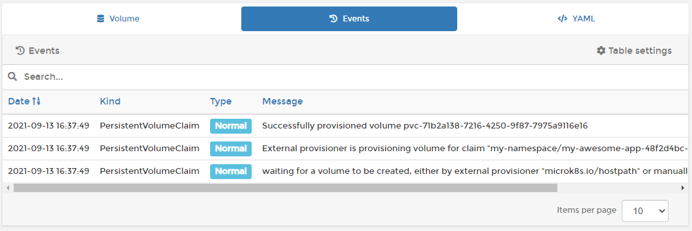
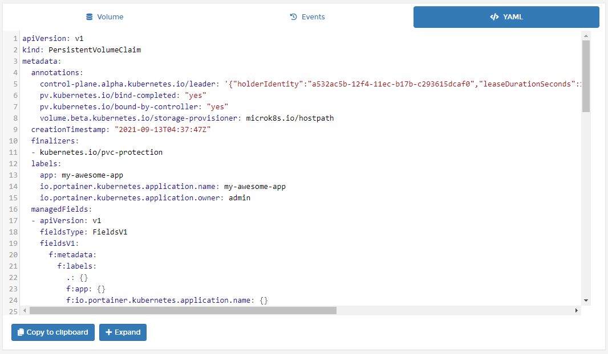

# Inspect a volume

From the menu select **Volumes** then select the volume you want to inspect.

When you select a volume, the screen will divide into three sections, each described below.

## Volume section

Summarizes key information about the volume.

| Attribute | Overview |
| :--- | :--- |
| Name | The name of the volume. |
| Namespace | The namespace that the volume belongs to. |
| Storage | The storage object that the volume uses. |
| Shared Access Policy | The access policy configured for the volume. |
| Provisioner | The storage provisioner that provisions the volume. |
| Creation date | When the volume was created. |
| Size | The size of the volume. You can grow a volume by clicking the **Increase size** button and adjusting the value. Shrinking a volume is not supported. |

## Events section

Shows information about volume-related events.

## YAML section

This displays the YAML generated from the volume deployment. Use it to create backups of the configuration.

