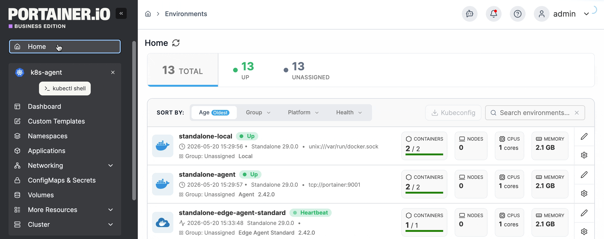
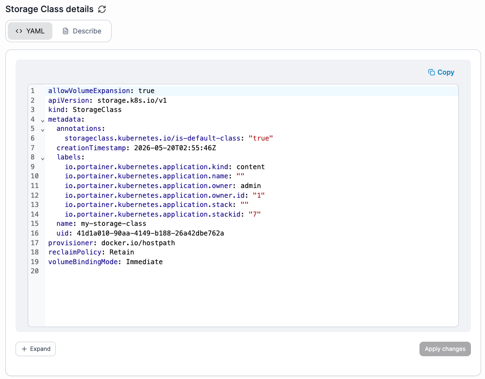
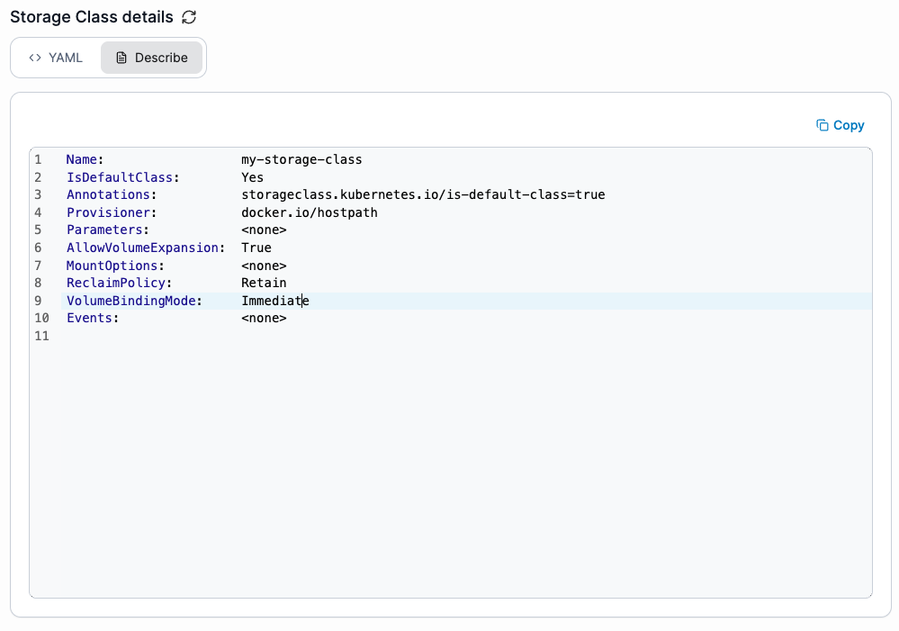

---
metaLinks:
  alternates:
    - >-
      https://app.gitbook.com/s/Dalese9Lv4CX6YKS1s45/user/kubernetes/volumes/inspect
---

# Inspect and edit a volume

From the menu, select **Volumes**, then select the persistent volume, persistent volume claim, or storage class you want to inspect.

<figure><figcaption></figcaption></figure>

The details view displays the YAML and description of the volume.

## YAML

Displays the YAML generated from the application deployment and lets you edit it directly. Changes made here are applied using the Kubernetes `patch` mechanism.

<figure><figcaption></figcaption></figure>

## Describe

Displays the raw description of the volume.

<figure><figcaption></figcaption></figure>
