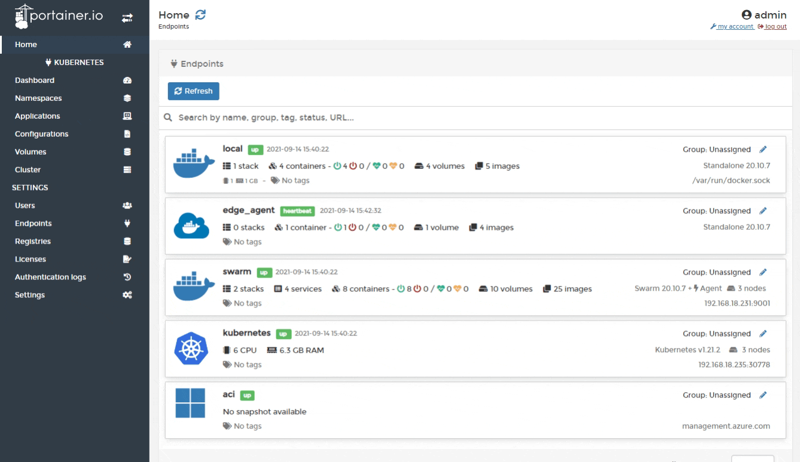
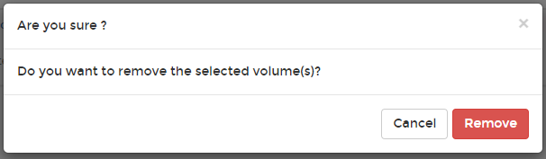

# Remove a volume


You can only remove a volume that is free and has been [detached from any applications that use it](../applications/detach-volume.md).


From the menu select **Volumes**, tick the checkbox next to the volume you want to remove then click **Remove**.

When the confirmation message appears, click **Remove**.

