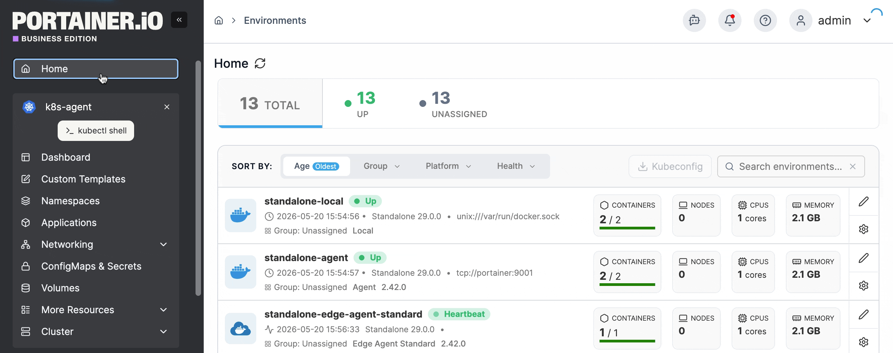
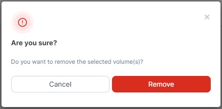

---
metaLinks:
  alternates:
    - >-
      https://app.gitbook.com/s/Dalese9Lv4CX6YKS1s45/user/kubernetes/volumes/remove
---

# Remove a volume


You can only remove a volume that is free and has been [detached from any applications that use it](../applications/detach-volume.md).


From the menu select **Volumes**, tick the checkbox next to the persistent volume, persistent volume claim or storage class you want to remove then click **Remove**.

<figure><figcaption></figcaption></figure>

When the confirmation message appears, click **Remove**.

<figure><figcaption></figcaption></figure>
