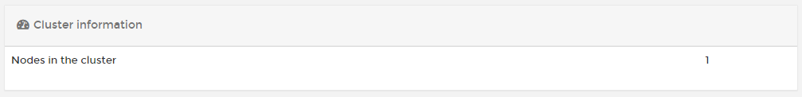
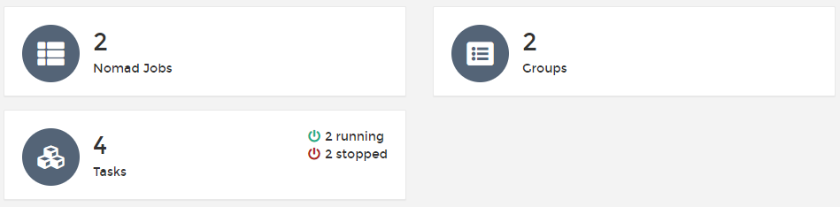

# Dashboard

The Nomad dashboard summarizes your Nomad environment and shows the components that make up the environment.

## Cluster information

This section shows the number of nodes in the cluster.

## Summary tiles

The remaining dashboard is made up of tiles showing the number of [jobs](jobs.md), groups and tasks (including the number of running and stopped tasks) on the Nomad environment.

