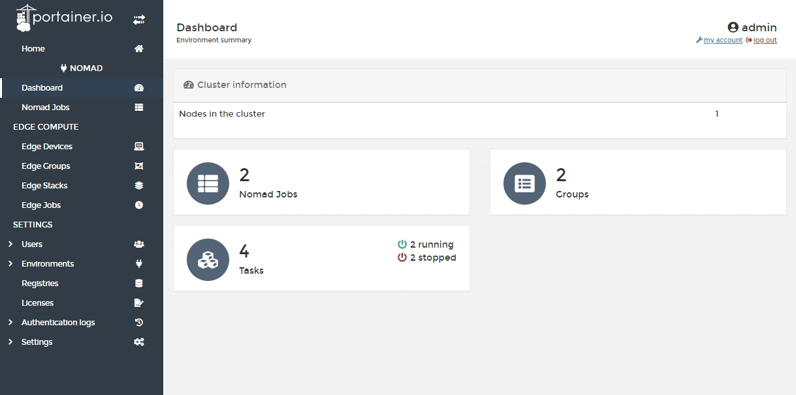
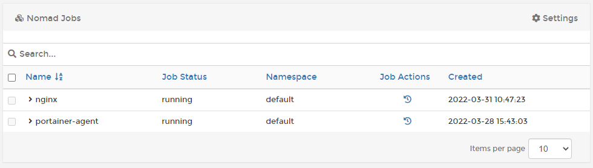
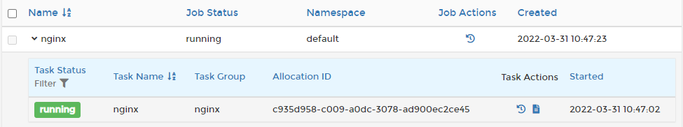

# Nomad Jobs

In Nomad, a Job is a specification that defines a workload for Nomad. Within a job you will find one or more task groups, which consist of one or more tasks. Portainer lets you view the jobs and subsequent tasks that are deployed to your Nomad environment.


To deploy a new job to a Nomad environment, use the [Edge Stacks](../edge/stacks.md) feature under [Edge Compute](../edge/). This requires you to [enable Edge Compute features](../../admin/settings/edge.md) and create an [Edge Group](../edge/groups.md) containing your Nomad environments.


From the left hand menu select **Nomad Jobs**.

Here you will see a list of jobs on the environment along with their status, namespace, and creation date. You can expand individual jobs by clicking the arrow to the left of the name.

In the expanded view, you can see a list of tasks that make up the job, with each task displaying the task status, name, group, allocation ID and start date. You can also view events and logs for each task under Task Actions.

