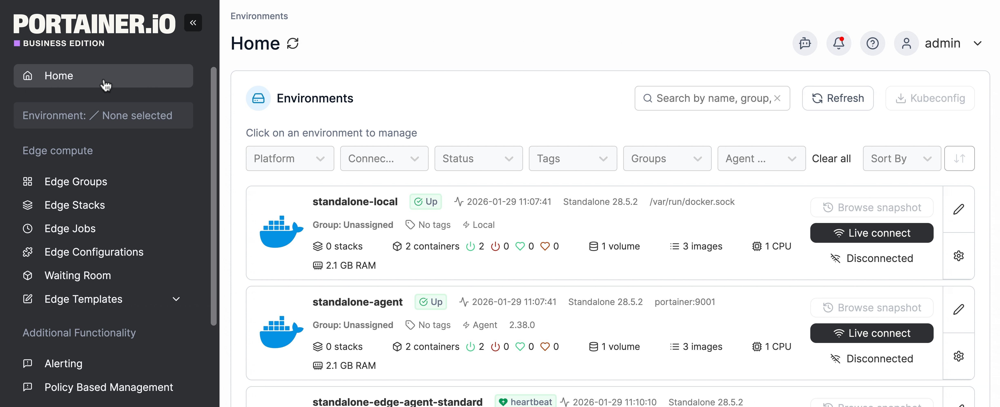
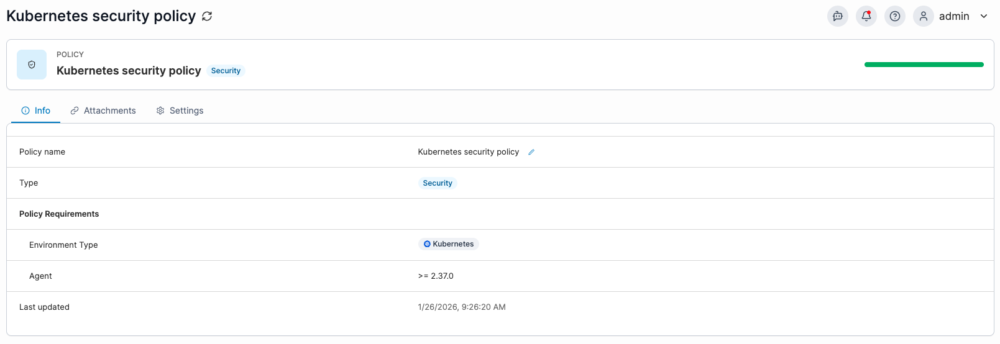
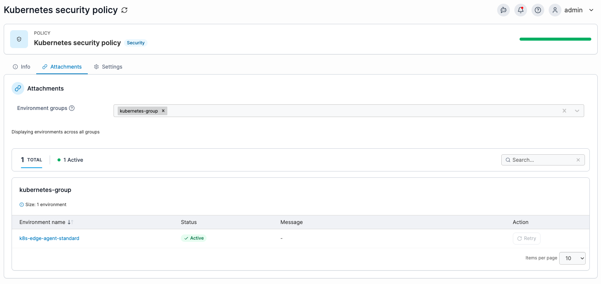
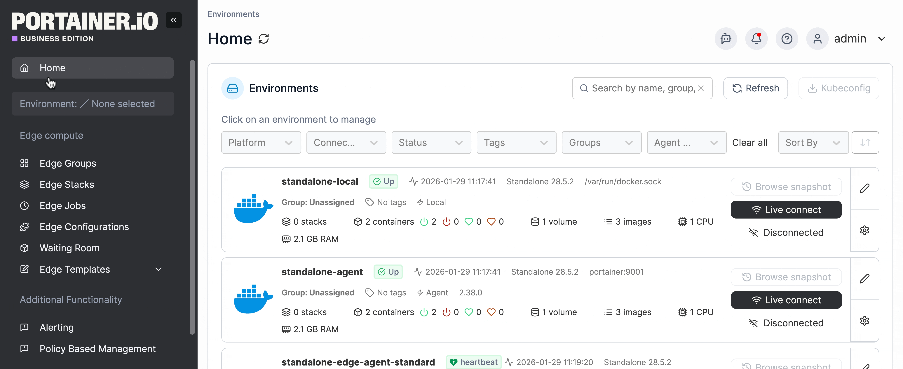

---
metaLinks:
  alternates:
    - https://app.gitbook.com/s/udjBY77rL45c6FTs07xf/admin/environments/policies
---

# Policies


Policies is part of the new Policy Based Management functionality which is considered a beta feature:\
\- To access this feature, enable **Policy Based Management** in the [additional functionality](../../../admin/settings/general.md#additional-functionality) section within the settings.\
\- Use this feature with caution and expect changes or additions as development continues. Issues we are aware of include:

* Policies may not act as intended when there is an existing environment level access in place. We recommend creating policies only for new environment setups.



Policies can only be applied to Edge (Standard) Agent environments that are of version 2.37.0 or greater.



Policies can only be created in Portainer Business Edition.


Policies introduces a centralized configuration and policy inheritance as part of the Policy Based Management feature set. This allows you to apply configuration, security rules, and cluster settings to groups of environments, rather than configuring each environment individually. By defining settings once at the group level, all child environments inherit those values, helping you keep access consistent and reduce configuration drift. Any created policies will override existing environment level access.

## Create a new policy

From the menu, under **Additional Functionality**, select **Policy Based Management**.

<figure><figcaption></figcaption></figure>

There are multiple policy types available, depending on the environment type you are managing and the kind of access you want to enforce. You can use the search function or filter by environment type or policy category to narrow down the list.

After selecting a policy type, select **Continue** at the bottom of the page to open the configuration form. The fields shown will vary depending on the policy you are creating, and each form guides you through the required settings for that specific policy. Select an environment type below for more details on creating the policy.&#x20;


[kubernetes-policies](kubernetes-policies/)



[docker-policies](docker-policies/)


## View policy details

From the menu, under **Additional Functionality**, select **Policy Based Management**. The policies page lists all existing policies. To see the details of an existing policy, click on the policy name.&#x20;

<figure><figcaption></figcaption></figure>

Three tabs display the policy details: **Info**, **Attachments**, and **Settings**. These details are read-only for standard users and can be edited by admin users from this view.

### Info

The **Info** tab displays general information about the policy setup.

| Field/Option        | Overview                                                                                                                                                                                                                                                          |
| ------------------- | ----------------------------------------------------------------------------------------------------------------------------------------------------------------------------------------------------------------------------------------------------------------- |
| Policy name         | 
The name of the policy and how it appears in the Policies list on the dashboard. To update the policy name, click the pencil icon next to the name, then click the tick to save the change.
                                                             |
| Type                | The type of policy: RBAC, Security, Setup, or Registry.                                                                                                                                                                                                           |
| Policy Requirements | The policy requirements define the conditions an environment must meet to be added to this policy, such as the environment type and agent version. Currently, policies can only be applied to Edge (Standard) Agent environments running version 2.37.0 or later. |
| Last updated        | The date and time that the policy was last updated.                                                                                                                                                                                                               |

<figure><figcaption></figcaption></figure>

### Attachments&#x20;

The attachment tab displays details about the environments attached to the policy. Within this view, you can filter on status, or use the search bar to find specific environments.&#x20;

| Field/Option       | Overview                                                                                                                                                       |
| ------------------ | -------------------------------------------------------------------------------------------------------------------------------------------------------------- |
| Environment groups | 
The environments applied to this policy. Add environments to the policy by selecting groups from the dropdown menu.
                                  |
| Environment name   | The name of the environment within the attached group. Click the environment name to open the environment dashboard.                                           |
| Status             | A status indicating whether the policy is successfully applied to the environment. If the status is not Active, the policy will not apply to the environment.  |
| Message            | If there is an issue applying the policy to an environment, this message field provides details about the status.                                              |

<figure><figcaption></figcaption></figure>

### Settings&#x20;

The Settings tab shows the policy configuration. Settings vary by policy type. Details for each policy type are covered in the [Kubernetes policies](kubernetes-policies/) and [Docker policies](docker-policies/) sections of this documentation.

## Remove a policy

From the menu, under **Additional Functionality**, select **Policy Based Management**. Tick the checkbox next to the policy you want to remove then click **Remove**.

<figure><figcaption></figcaption></figure>
