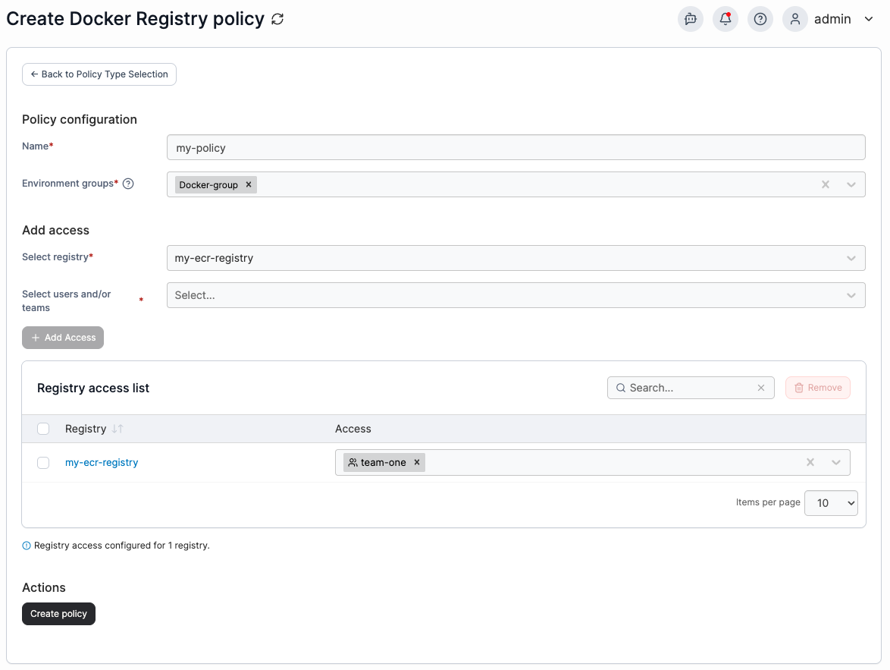

---
metaLinks:
  alternates:
    - >-
      https://app.gitbook.com/s/udjBY77rL45c6FTs07xf/admin/environments/policies/registry-policy
---

# Create a Docker, Swarm or Podman registry policy

Define a policy by managing registry access and configuration for Kubernetes clusters.

To create a registry policy, in the menu, under **Additional Functionality**, select **Policy Based Management** then select **Create policy**. From the policy type list, navigate to the **Docker** > **Registry** section, select **Custom** then select **Continue** to begin configuring the policy.


Currently, only custom registry policies can be created. Future improvements to the policies feature will introduce policy templates.


| Field/Option              | Overview                                                                                                                                                                                                                                           |
| ------------------------- | -------------------------------------------------------------------------------------------------------------------------------------------------------------------------------------------------------------------------------------------------- |
| Name                      | Define a name for this policy.                                                                                                                                                                                                                     |
| Environment groups        | 
Select one or more environment <a href="../../../../admin/environments/groups.md">groups</a> from the dropdown menu. If the selected group is already included in an existing policy, a warning icon will appear next to the group name.
 |
| Select registry           | ​Select a [registry](../../../kubernetes/cluster/registries.md) from the dropdown menu. ​                                                                                                                                                          |
| Select users and/or teams | Select one or more [user](../../../../admin/user/users.md) or [team](../../../../admin/user/teams/) that you want to have access to the selected registry.                                                                                         |

<figure><figcaption></figcaption></figure>

Click **Add Access** to add the registry to the access list, multiple entries can be added. Each access added will show in the **Registry access list**. When you have finished adding access, click **Create policy**. A confirmation screen displays the changes being made and any existing policy that will be replaced. Click **Confirm** to acknowledge the changes and create the policy.
