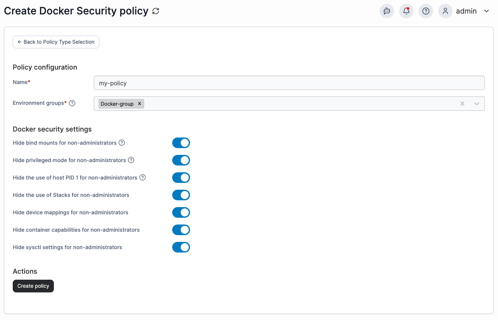

---
metaLinks:
  alternates:
    - >-
      https://app.gitbook.com/s/udjBY77rL45c6FTs07xf/admin/environments/policies/security-policy
---

# Create a Docker, Swarm or Podman security policy

Define a policy by specifying security constraints for Docker, Swarm, or Podman environments.

To create a security policy, in the menu, under **Additional Functionality**, select **Policy Based Management** then select **Create policy**. From the policy type list, go to **Docker** > **Security**, select either a predefined template or the **Custom** policy, then select **Continue** to start configuring the policy.

| Field/Option                                       | Overview                                                                                                                                                                                                                                                                                                                                                                                                                                                                                                                |
| -------------------------------------------------- | ----------------------------------------------------------------------------------------------------------------------------------------------------------------------------------------------------------------------------------------------------------------------------------------------------------------------------------------------------------------------------------------------------------------------------------------------------------------------------------------------------------------------- |
| Name                                               | Define a name for this policy.                                                                                                                                                                                                                                                                                                                                                                                                                                                                                          |
| Environment groups                                 | 
Select one or more environment <a href="../../../../admin/environments/groups.md">groups</a> from the dropdown menu. If the selected group is already included in an existing policy, a warning icon will appear next to the group name.
                                                                                                                                                                                                                                                                      |
| Hide bind mounts for non-administrators            | Prevents non-admin users within Portainer from using bind mounts when creating containers and/or services/stacks. When toggled on, the option to attach to a host file system path is removed.                                                                                                                                                                                                                                                                                                                          |
| Hide privileged mode for non-administrators        | Prevents non-admin users from elevating the privilege of a container to bypass SELinux/AppArmor. When toggled on, the option to select **Privileged** mode when [adding a container](../../../docker/containers/add.md) is removed.                                                                                                                                                                                                                                                                                     |
| Hide the use of host PID 1 for non-administrators  | Prevents non-admin users from requesting that a deployed container operates as the host PID. This is a security risk if used by a non-trustworthy authorized user because when they operate as PID1, they are in effect able to run any command in the container console as root on the host.                                                                                                                                                                                                                           |
| Hide the use of Stacks for non-administrators      | This is a 'sledgehammer' approach to removing any possibility for non-admin users within Portainer to find and use weaknesses in the Docker architecture. Whilst Portainer has the ability to disable some of the more common exploits, we cannot possibly block them all because there are any number of capabilities that could be added to a container to attempt to gain access to the host. This feature simply allows an admin to disable all possible entry points.                                              |
| Hide device mappings for non-administrators        | Blocks users from mapping host devices into containers. Whilst the ability to map devices is generally used for good (e.g. mapping a GPU into a container), it can equally be used to map a physical storage device into a container. It is possible to mount `/dev/sda1` into a container, and then from a console of that container, the user would have complete access to the sda1 device without restriction. By toggling this on, Portainer blocks the ability for non-admins to map ANY devices into containers. |
| Hide container capabilities for non-administrators | Toggle on to hide the **capabilities** tab for non-administrators when they are [adding a container](../../../docker/containers/add.md).                                                                                                                                                                                                                                                                                                                                                                                |
| Hide sysctl settings for non-administrators        | Toggle on to stop non-admin users from using sysctl options, preventing them from recreating, duplicating or editing containers.                                                                                                                                                                                                                                                                                                                                                                                        |

<figure><figcaption></figcaption></figure>

When you have completed the form, click **Create policy.** A confirmation screen displays the changes being made and any existing policy that will be replaced. Click **Confirm** to acknowledge the changes and create the policy.
