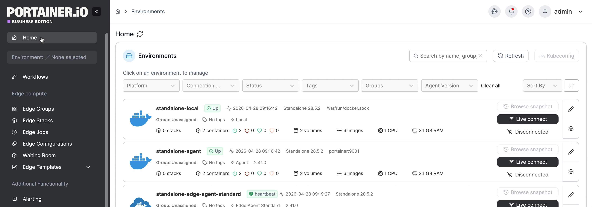
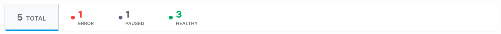
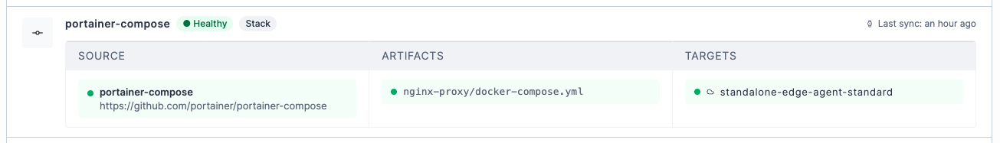

# Workflows

Workflows provides a single view of all Docker, Edge, and Kubernetes workloads deployed from a Git repository, giving you a unified overview of deployment health across your environments. From here you can quickly identify anything that needs attention and jump directly to the relevant stack or application.

Workflows is a read-only view - to create or edit a GitOps configuration, use the [Docker Stacks](docker/stacks/add.md#option-3-git-repository), [Kubernetes Applications](kubernetes/applications/manifest/create.md#repository), or [Edge Stacks](edge/stacks/add/) views.


Supporting resources such as Service Accounts, ConfigMaps, and Secrets deployed via Create from code are not included in the workflow view.


To access Workflows, select **Workflows** in the left-hand menu.

<figure><figcaption></figcaption></figure>

At the top of the page, a count of all your workflows is displayed, broken down by status. Click any segment to filter the workflow list by that status. The total count reflects all workflows visible to you.

<figure><figcaption></figcaption></figure>

A workflow will have one of the following statuses:

| Status  | Definition                                                                                                          |
| ------- | ------------------------------------------------------------------------------------------------------------------- |
| Error   | The last deploy attempt failed. When in error state, a reason for the error will be displayed in the workflow card. |
| Syncing | A deploy is currently in progress (pulling, deploying, or rolling back).                                            |
| Healthy | The last deploy completed successfully.                                                                             |
| Paused  | The stack or Edge Stack is inactive or paused.                                                                      |
| Unknown | No deployment status is available yet, or the state cannot be classified.                                           |

The workflows table lists each GitOps-configured stack or application as a workflow card. The list is searchable and sortable, and can be filtered by status, type, or platform.

Each workflow card displays the following information:

<figure><figcaption></figcaption></figure>

| Element       | Description                                                                                                                                                          |
| ------------- | -------------------------------------------------------------------------------------------------------------------------------------------------------------------- |
| Workflow name | The name of the stack/application. Click on the stack name to navigate directly to the stack or application.                                                         |
| Status badge  | Shows the current sync status: **Healthy**, **Syncing**, **Paused**, **Error**, or **Unknown**.                                                                      |
| Type badge    | Shows whether this is a **Stack** or an **Edge Stack**.                                                                                                              |
| Last sync     | A timestamp of the last successful deploy. For Edge Stacks, this reflects the oldest successful sync across all target endpoints and is labelled as **Oldest sync**. |
| Error banner  | If the workflow is in an **Error** state, the underlying error message is displayed in red beneath the pipeline detail row.                                          |
| Source        | The workflow name and Git repository URL. The dot indicates whether Portainer can connect to the repository.                                                         |
| Artifacts     | The config file path being fetched (e.g. `docker-compose.yml`). The dot indicates whether the manifest file can be located.                                          |
| Targets       | The environments that this workflow is targeting. Click this name to navigate to the environment dashboard.                                                          |
