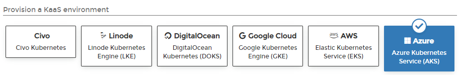
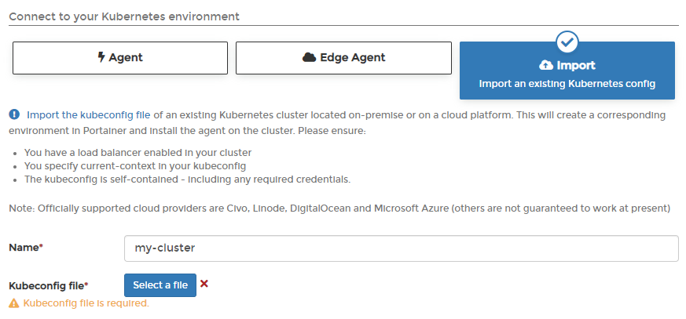
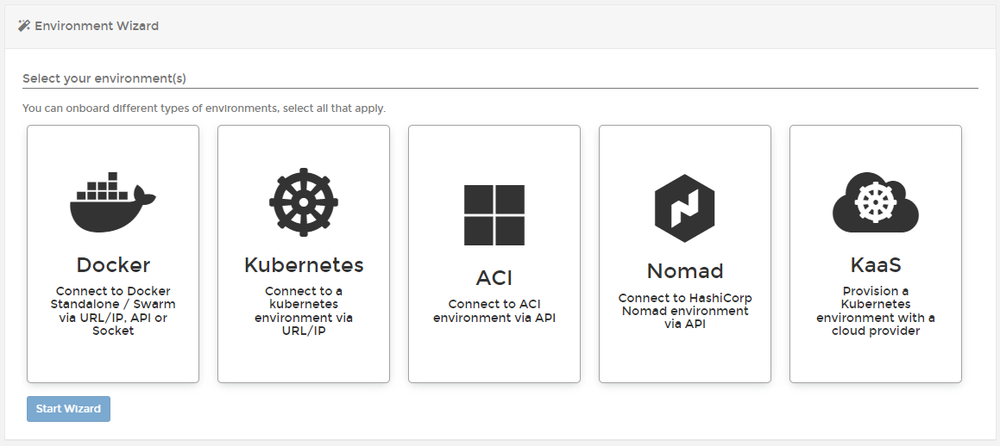
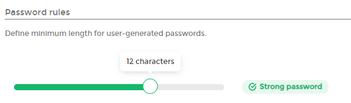

# What's new in version 2.14

Portainer version 2.14 includes a number of changes and updates as well as some new Business Edition-specific features. For a full list of changes, please refer to our [release notes](release-notes.md).

## New Features

### New Kubernetes-as-a-Service providers 

In 2.13 we introduced support for [provisioning Kubernetes clusters](start/install/agent/kaas/) directly from Portainer on [Civo](start/install/agent/kaas/civo.md), [Linode](start/install/agent/kaas/linode.md) and [DigitalOcean](start/install/agent/kaas/digitalocean.md). In this release, we've expanded that even further to include [Amazon EKS](start/install/agent/kaas/eks.md), [Google GKE](start/install/agent/kaas/gke.md), and [Azure AKS](start/install/agent/kaas/aks.md). We've also refreshed the [cloud credentials interface](admin/settings/cloud/) as part of this work, as well as updated our documentation with examples of how to retrieve the necessary credentials for these providers.

### Import your existing Kubernetes environment 

We've long supported deploying the Portainer Agent to existing Kubernetes environments, but with 2.14 we've made this even easier with the ability to [import your kubeconfig file](start/install/agent/kubernetes/import.md) directly into Portainer, and have Portainer automatically configure access and deploy the agent for you. This works with both cloud providers and on-premise Kubernetes installations.

### Add Environment Wizard 

When you first install Portainer you're presented with the environment wizard, allowing you to add the environments you wish to manage, but after that you'd use our traditional interface to add more. In 2.14 we've improved the environment wizard and brought it in to be used at any point to [add new environments](start/install/agent/).

### Out of date image indicators 

Version 2.14 adds a new column to the containers, stacks and services listings which will let you know whether an image used is up to date or if there's a new version available. This lets you easily tell which containers, stacks or services you need to update.

### Improvements to custom templates 

App templates are a powerful feature for system administrators, letting you set up templated applications for users to easily deploy. In 2.14 we've extended our custom templates to let you easily [create variables within your templates](user/docker/templates/custom.md#variables-in-templates) that a user can later fill in when deploying the template, allowing for much more customization of the individual deployment.

### Environment variable support for webhooks 

Along the same lines as the custom templates changes, we've also added support for [environment variables to be passed over webhooks](user/docker/stacks/webhooks.md#using-environment-variables-with-webhooks) in 2.14. Using this, you can customize your triggers to provide custom information to Portainer that it can use alongside the redeployment.

### Reworking the Team Leader role 

We've spent some time reworking our existing Team Leader role in 2.14, fixing a few bugs and expanding the capabilities of the role. Team Leaders can now add and remove members from teams as well as promote members to co-team leaders.

### Adjustable password length requirements 

In 2.13 we introduced password strength requirements to Portainer. In this version, we've taken on the feedback that you've provided and made these requirements [adjustable by administrators](admin/settings/authentication/). An admin can now set the minimum length required for a password, and users that don't meet that requirements will be asked to update the passwords when they next log in, with the option to defer the change a couple of times before being required to make the change. We also removed the complexity requirements and just restrict on length.

### Dependency updates 

We've updated a number of our third-party dependencies in this release, including docker, docker-compose, helm and kubectl. One specific thing to note is that this adds docker-compose version 2 support to Portainer.
