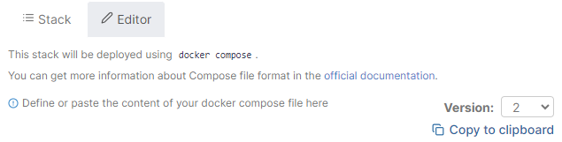
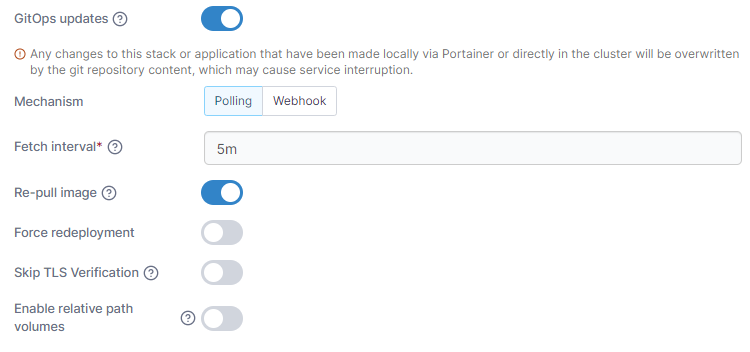
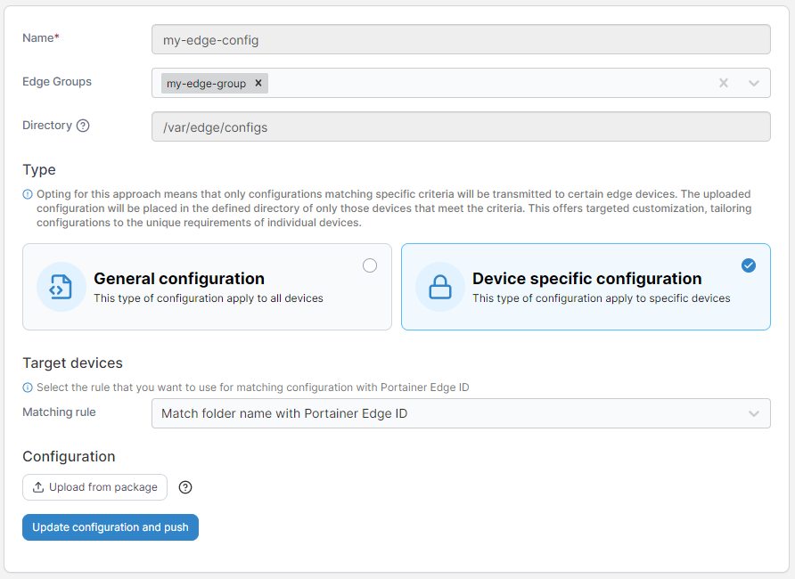
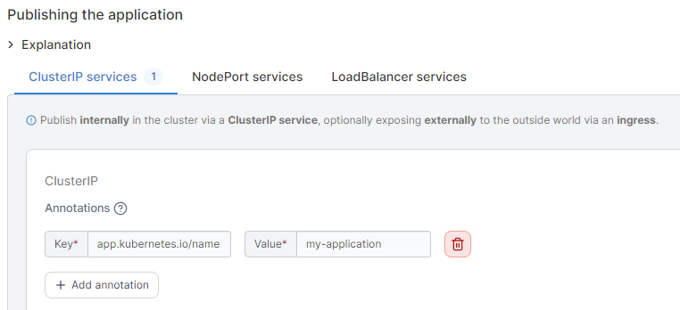
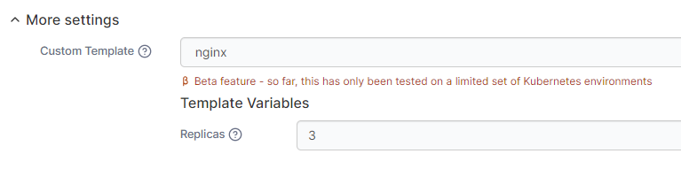
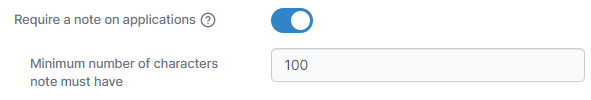

# What's new in version 2.19

Portainer version 2.19 includes a number of new features, fixes and updates. For a full list of changes, please refer to our [release notes](release-notes.md).

## New Features

### Improved page load performance  

We've made more improvements to page load performance in this release, in particular around the Kubernetes applications page. We've also split the [ConfigMaps & Secrets](user/kubernetes/configurations/) page into two tabs that load separately, which should reduce load time when you have a large amount of either. There's still more work to be done here, so you can expect more improvements in the future.

### Update Portainer within Portainer 

Having to drop out to the command line to update Portainer when a new version comes out has always been a bit of an annoyance, and in 2.19 we've got rid of that for BE users by letting you [update to the latest version](start/upgrade/#from-within-portainer) right from within the Portainer UI. Admin users will see a notice and a link they can click on to upgrade Portainer to the latest version, without needing to do it manually.

<figure><figcaption></figcaption></figure>

### Stack versioning and rollback 

When using stacks in Portainer, you may sometimes make a change that doesn't quite work as you expect. With 2.19, we've added stack versioning to Portainer, which lets you keep a record of your previous stack configuration when deploying an update.

<figure><figcaption></figcaption></figure>

If you run into issues, you can roll back to the previous stack configuration that Portainer kept for you. This is available for both Docker Standalone and Docker Swarm stacks.

### GitOps for Edge Stacks 

Way back in version 2.10 of Portainer we added GitOps support for stacks, letting you deploy from a Git repo directly onto your environment. In 2.19, we've brought that support to Edge Stacks as well, meaning you can [use Git as the source of truth](user/edge/stacks/add.md#gitops-updates) for your Edge Stack deployments. This includes support for webhooks to trigger updates on your Edge Stacks, relative path support, and support for environment variables.

<figure><figcaption></figcaption></figure>

As part of this we've also introduced an [Edge Configurations](user/edge/configurations.md) section. This feature lets you pre-deploy configuration files to your Edge devices, either by group or by specific device identifier, to a location that your stacks will be able to refer to. This means you can keep your Edge stack repos thin and performant, while still letting you provide the necessary config files to get your app up and running.

<figure><figcaption></figcaption></figure>

### Staggered deployment for Edge Stacks &#x20;

If you've got a large number of Edge Devices you're deploying to, you might not always want to push an update to every one of them at once, in case something goes wrong. With 2.19 you can now [stagger your Edge Stack deployments](user/edge/stacks/add.md#update-configurations) to suit your needs.

<figure><figcaption></figcaption></figure>

You can either choose a static number of devices to update concurrently, or update your deployment exponentially in growing groups. You can set the timeout and delay for your deployments, and choose how to act if the update fails, including whether to roll back to the previous version.

### Edge Stack status improvements &#x20;

Alongside the staggered deployment functionality, we've also put some work into improving the way we display the [status of your Edge Stacks](user/edge/stacks/).

<figure><figcaption></figcaption></figure>

We've moved to using progress bars to display the amount of deployments at each status, letting you clearly see the state of your Edge Stack across your devices. We've also added a record of when each device reached each status through the Environments tab on the Edge Stack's details page, as well as the target and deployed versions of the Edge Stack as part of the new stack versioning feature.

### Improved MicroK8s cluster management 

In version 2.18 we added provisioning of MicroK8s directly on to fresh machines from within Portainer. In 2.19 we've extended the functionality around [managing MicroK8s environments](user/kubernetes/cluster/#microk8s-cluster-management) deployed this way, adding support for upgrading, scaling and deleting nodes in the cluster, the enabling and disabling of addons after provisioning, as well as being able to customize arguments for your addons.

<figure><figcaption></figcaption></figure>

You can also now specify which nodes should be control planes when provisioning, and we've refreshed the provisioning workflow to take advantage of the new functionality.

### Annotation support for services 

Portainer now supports [configuring annotations for Kubernetes services](user/kubernetes/applications/add.md#publishing-the-application) from the UI, alongside the other areas that already supported annotations in previous versions.

<figure><figcaption></figcaption></figure>

Annotations are particularly useful when configuring service meshes and other tools.

### Auto deploy a manifest to new environments 

When you're deploying a new Kubernetes environment, you may want to run an "initial setup" manifest on the environment to get it configured the way you want it. With 2.19 you can now specify a manifest to automatically deploy when you [provision](admin/environments/add/kaas/) or [create](admin/environments/add/kube-create/) a new Kubernetes environment or [add the Portainer Agent](admin/environments/add/kubernetes/agent.md) to an existing Kubernetes cluster.

<figure><figcaption></figcaption></figure>

This lets you pre-configure things like namespaces, secrets and anything else you need automatically.

### Support requiring notes on applications 

In larger organizations (and even smaller ones), if you have a lot of deployments it might be hard to keep track of what each one is for. In 2.19 we've added a configuration option to [enforce the setting of notes](admin/settings/#deployment-options) on new deployments.

<figure><figcaption></figcaption></figure>

Using this you can require that your team adds a description to every deployment they push out, making it easier to find detail on the deployment down the line.
