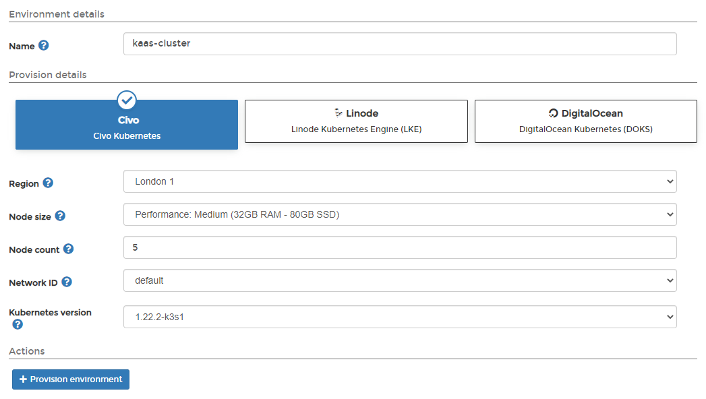
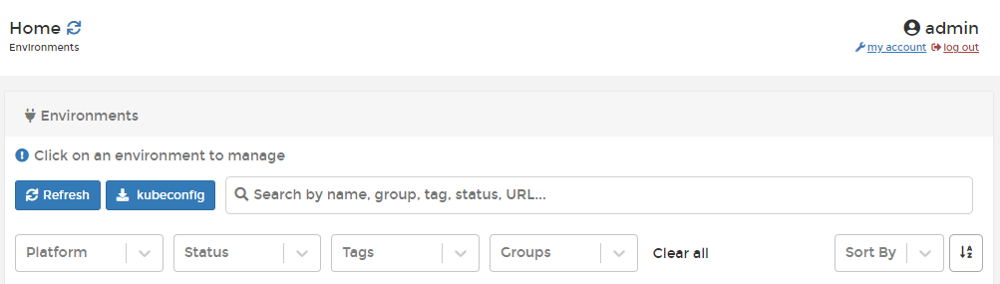
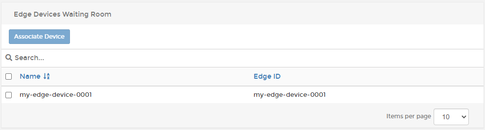
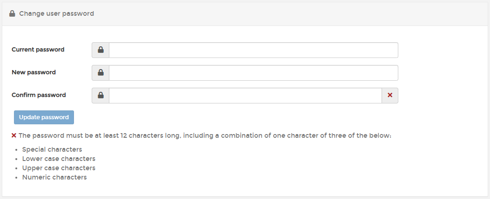

# What's new in version 2.13

Portainer version 2.13 includes a number of changes and updates from previous versions as well as some new Business Edition-specific features. For a full list of changes, please refer to our [release notes](release-notes.md).

## Concurrent release of Community and Business Editions

Version 2.13 marks the first time we're releasing both Business Edition and Community Edition at the same time. This is part of us streamlining our release process, and you can expect to see concurrent releases like this going forward.&#x20;

To go along with this, we're also combining our documentation into a single release, rather than the split between the Business Edition and Community Edition that has been done previously. Any features that are Business Edition specific will be noted in the documentation.

## New Features

### Provisioning Kubernetes in the Cloud 

One of the most exciting new features in 2.13 is the ability to provision Kubernetes environments on cloud providers directly from within Portainer. With a couple of clicks, you can spin up a Kubernetes environment in the cloud right from Portainer itself, automatically deploying the Portainer Agent to the new cluster ready for you to manage.

In this release, we're supporting provisions on [Civo](start/install/agent/kubernetes/kaas.md#civo), [Linode](start/install/agent/kubernetes/kaas.md#linode) and [DigitalOcean](start/install/agent/kubernetes/kaas.md#digitalocean), with more providers to come in the future.

### Home page filtering 

As you add more environments to Portainer, the list on the home page may grow. To help with this, we've added filtering options to the home page. With these you can filter the list of environments displayed by platform, status, tags and groups, making things a lot easier to find.

### Registry browsing for non-admins 

[Registry browsing](admin/registries/browse.md) has been a popular feature of our Business Edition, and in 2.13 we've expanded the access to this feature to non-admin users. Users will only be able to see and browse registries that they have been assigned by admins, and they'll only be able to interact at the level of access they've been given by their role (for example, read only users will have read only access to the registry).&#x20;

### Edge Agent Waiting Room 

The Edge Agent Waiting Room functionality lets you pre-load Edge devices with a script to deploy the Edge Agent and connect back to the Portainer Server without having to pre-configure the environments in Portainer. Newly connecting devices go into a "waiting room", where an admin user would approve or deny those devices connecting to the environment. This is extremely powerful if you're deploying a large number of devices and aren't able to manually configure each one when they're connected for the first time.&#x20;

You can read more about this feature in our [accompanying blog post](https://www.portainer.io/blog/pre-staging-edge-environments-with-portainer).

### Private registries for Edge Stacks 

BE 2.13 adds support for private registries to our [Edge Stacks](user/edge/stacks.md) functionality. This lets you deploy stacks on Edge devices from sources other than Docker Hub, including your own company registries [set up within Portainer](admin/registries/).

### Environment variables from the local system available in Edge Stacks 

Portainer 2.13 now supports the passing of local environment variables to Edge Stacks on Edge devices. With this, an Edge stack can reference environment variables defined on the local environment of the Edge device. For example, an Edge device could have a location environment variable on the device itself that can be referenced by the stack deployed to it.

### Enforcing strong passwords 

On the security front, we've improved security for Portainer's internal authentication method by requiring that you use strong passwords for your users. Passwords will need to be at least 12 characters, and include at least **three** of the following **four** character types:&#x20;

* Lower case letters
* Upper case letters
* Numeric characters
* Special characters

If you're upgrading Portainer and your existing passwords don't meet this requirement, you'll be prompted to [change your password](user/account-settings.md#changing-your-password) when you first log in after the upgrade.

This feature only applies to those using Portainer's internal authentication - if you're using an external authentication provider like [Active Directory](admin/settings/authentication/active-directory.md) or [OAuth](admin/settings/authentication/oauth.md), this won't apply to you.

### Dependency updates to resolve CVEs 

We've also spent some time updating our third-party dependencies within the Portainer image to resolve some reported CVEs, and we'll continue to keep an eye out for these in the future, updating the dependencies as needed.
