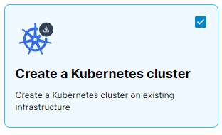
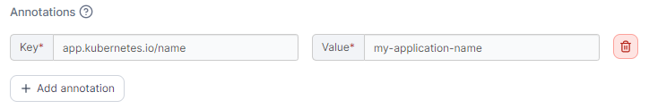
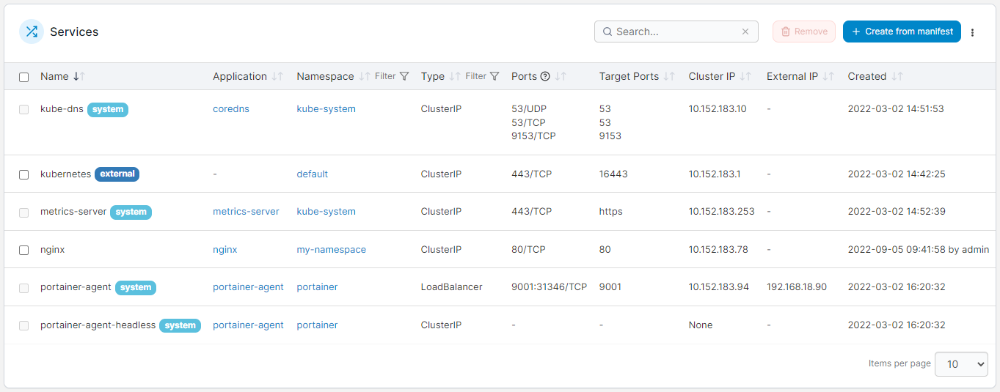
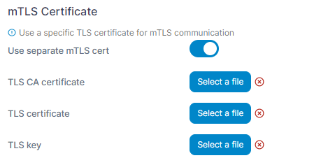

# What's new in version 2.18

Portainer version 2.18 includes a number of new features, fixes and updates. For a full list of changes, please refer to our [release notes](release-notes.md).

## New Features

### Improved page load performance  

One of the first things you might notice in 2.18 is a snappier UI. We've made a number of changes to the Portainer interface in this version to improve load times across the board, with some specific changes around the number of notifications displayed, adding the ability to disable GPU functionality on environments where it isn't needed, and streamlining the environment API calls made throughout the app, in particular for Kubernetes environments.

We'll be continuing to look for areas where we can improve performance, so look out for more of this in future releases.

## Kubernetes

### MicroK8s cluster creation 

In the Kubernetes space, 2.18 brings the ability to [provision and configure a MicroK8s Kubernetes cluster](admin/environments/add/kube-create/) directly onto fresh machines, straight from the Portainer interface. All you'll need is SSH access to the machines and you're good to go. Provide one or more IP addresses of your servers, choose the version of MicroK8s to install and select any addons you require, and optionally select a custom application template to deploy once your cluster is created.&#x20;

<figure><figcaption></figcaption></figure>

Portainer will install MicroK8s, configure the cluster and deploy the Portainer Agent for you, getting you up and running on Kubernetes as painlessly as possible.

### Expanded annotation support 

In 2.18 we've expanded our support for adding Kubernetes annotations to resource types through the UI. You can now add annotations through the Portainer interface for namespaces, application deployments, ConfigMaps and secrets, with support for services coming in a future release.

<figure><figcaption></figcaption></figure>

### Kubernetes services view  

In this release we've added a new [Services](user/kubernetes/services.md) page to Kubernetes environments, which lists the services deployed on your cluster along with detail about each service, for example the application and namespace the service belongs to, the type of service, and any ports and IPs assigned to the service.&#x20;

<figure><figcaption></figcaption></figure>

This page replaces the port mappings tab from the Applications page and, along with our work on the Ingresses page in 2.16, is part of making the various objects in your Kubernetes cluster more visible when using Portainer.

## Edge

### Edge Agent Standard and Async  

In the Edge arena, we've continued on from the work in 2.17 to bring Edge Devices in alongside standard Edge Agent deployments. In 2.18 we've split Edge Agent provisioning into two types - Edge Agent Standard for the traditional Edge Agent environment deployment, and Edge Agent Async for asynchronous deployments.&#x20;

<figure><figcaption></figcaption></figure>

When [adding an environment](admin/environments/add/) you'll be able to choose between the two options so you can be sure you're deploying the configuration you need.

### Expanded snapshot functionality 

In more expansion of 2.17's features, Portainer's [snapshot functionality](user/home/snapshot.md) for async Edge Agents now lets you browse even more of your environment from the snapshot, including container status, volume, image and stack listing, and the ability to stop, start, restart and kill containers as needed. You'll also be able to see more detail including which images and networks are in use as well as environment variable details.

### mTLS specific certificate support 

Previously when deploying Edge Agents using mTLS you were restricted to using the same TLS certificate for both the Portainer user interface and your mTLS deployment. In 2.18, you can now [choose a specific set of certificates for mTLS use](admin/settings/edge.md#mtls-certificate), separate from the one used for Portainer itself. This is particularly useful when you have separate domains for access to Portainer and for your Edge Agent communications.

<figure><figcaption></figcaption></figure>

### Edge Stack retry policy 

2.18 sees the addition of a [retry policy](user/edge/stacks.md#retry-deployment) for your Edge Stacks. With retry deployment enabled, Portainer will keep trying to redeploy your stack if it runs into deployment errors. This helps to avoid failed deployments when a connection to the edge device may be unstable or unreliable.

<figure><figcaption></figcaption></figure>
