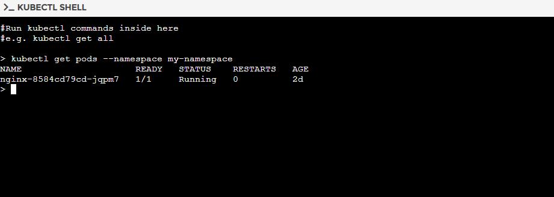
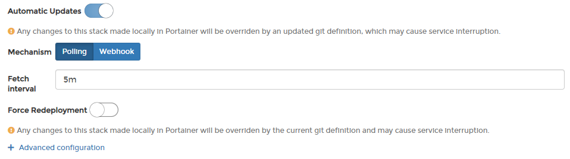
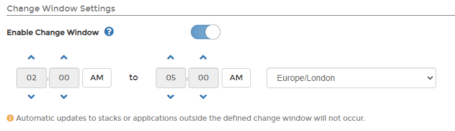
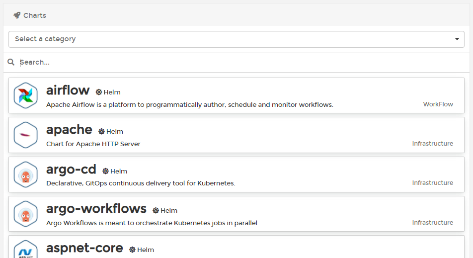
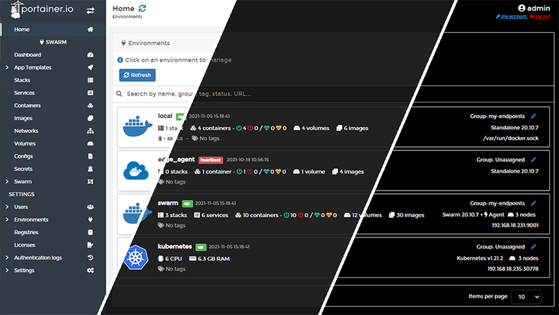

# What's new in version 2.10

Portainer Business Edition (BE) 2.10 includes a number of changes and updates from CE 2.9 as well as some new Business Edition-specific features. For a full list of changes, please refer to our [release notes](release-notes.md).

## New Features

### Portainer as a proxy for Kubernetes environments

We've introduced the ability for Portainer to be used as a [secured authenticated proxy](user/kubernetes/kubeconfig.md) to Kubernetes environments. This allows platform and DevOps engineers to install Portainer within an existing software delivery toolset (CI/CD) and to integrate seamlessly with these tools.

It also allows direct users of Portainer to access Portainer and retrieve the configuration files used to connect the tools of their choice (kubectl, helm, or another dashboard) to Portainer directly, while reflecting the access and permissions set by their administrator.

### Integrated kubectl shell within Portainer

In order to help troubleshooting edge cases with Kubernetes applications and clusters that cannot be diagnosed directly from within the Portainer UI, as well as to allow an expert user to use advanced Kubernetes capabilities that are not currently supported within Portainer, we've added the ability to [use the Kubernetes CLI directly](user/kubernetes/kubectl.md) within the Portainer UI.&#x20;

The kubectl shell provides access to run commands against your Kubernetes environment with the access level provided to that specific user by Portainer, ensuring security is maintained while still providing increased flexibility.

### A lightweight GitOps engine

CE 2.9 added a lightweight GitOps engine to Portainer to enable users to use a degree of CD automation without the need of an expert in this area to set up a CD system, and this functionality is now available in the Business Edition as well. Users can configure automatic updates for their [stack](user/docker/stacks/add.md#automatic-updates) or [application](user/kubernetes/applications/manifest.md#automatic-updates) in a poll-based (with Portainer polling for changes at a specified interval) or push-based (via webhooks) fashion.

Alongside this, BE 2.10 adds change window functionality for [Docker](user/docker/host/setup.md#change-window-settings), [Swarm](user/docker/swarm/setup.md#change-window-settings) and [Kubernetes](user/kubernetes/cluster/setup.md#change-window-settings), letting administrators define a window within which automatic updates can be applied. This is helpful to limit the potential downtime of applications due to updates to a specified block of time. BE 2.10 also allows a [stack](user/docker/stacks/add.md#automatic-updates) or [application](user/kubernetes/applications/manifest.md#automatic-updates) deployed from Git to force a redeployment regardless of changes in the remote repository, which is helpful when enforcing Git as the "source of truth" for your configurations.

Automatic updates also get logged fully as part of the Business Edition exclusive [activity logging](admin/logs/activity.md) functionality.

### Helm support

Helm is the de-facto packaging system for Kubernetes, and BE 2.10 brings [early support for Helm](user/kubernetes/helm/) to Portainer. You can now install applications using Helm charts from directly within the Portainer UI from public Helm repositories.

Portainer ships with the Bitnami Helm repository as default, but you can [replace this with your own](admin/settings/#helm-repository) public repository if needed.

### Dark and high-contrast modes

One of our most requested features, Portainer can now be used in [dark mode](user/account-settings.md#changing-the-theme). This is a per-user setting configured through their account settings. We've also included a high contrast option.

## Notable changes and fixes

### Revamped registry support

In an effort to make the registry experience consistent across Docker and Kubernetes, we have [revamped the way that registries are managed](admin/registries/) within Portainer. Registries can now be made available on a per-environment basis for [Docker](user/docker/host/registries.md), [Swarm](user/docker/swarm/registries.md) and [Kubernetes](user/kubernetes/cluster/registries.md), we've added the ability to [add authenticated DockerHub registries](admin/registries/add/dockerhub.md), and added private registry support for Kubernetes.

### Endpoints are now Environments

In CE 2.9 we renamed Endpoints to [Environments](admin/environments/), and BE 2.10 brings this change to the Business Edition as well. The use of the term "endpoints" was specific to Portainer and Docker, and we wanted to move to something more understandable and generic to encompass other types of environment like Kubernetes.

As part of this work, we have started work on a new environment onboarding experience, as user feedback indicated some confusion as to what to do next once Portainer was installed. On a new installation you will be presented with the environment wizard, guiding you through setting up the environments you want to manage with Portainer.

### HTTPS by default

New installations of Portainer are now configured with HTTPS support out of the box using a self-signed certificate. This certificate can be replaced with a supplied certificate both [during installation](advanced/ssl.md) and [after via the Portainer UI](admin/settings/#ssl-certificate). Using Portainer over HTTPS is required for the new [Kubernetes proxy](whats-new.md#portainer-as-a-proxy-for-kubernetes-environments) and [kubectl shell](whats-new.md#integrated-kubectl-shell-within-portainer) features.

For existing installations, our [upgrade instructions](start/upgrade/) include exposing both the HTTP and HTTPS ports on your installation while you transition over to using HTTPS.&#x20;
