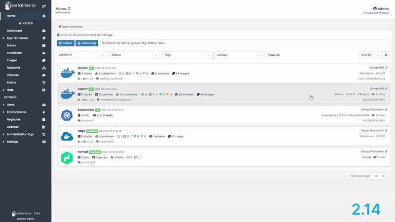
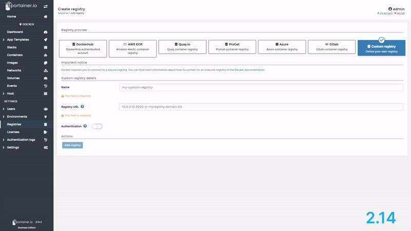
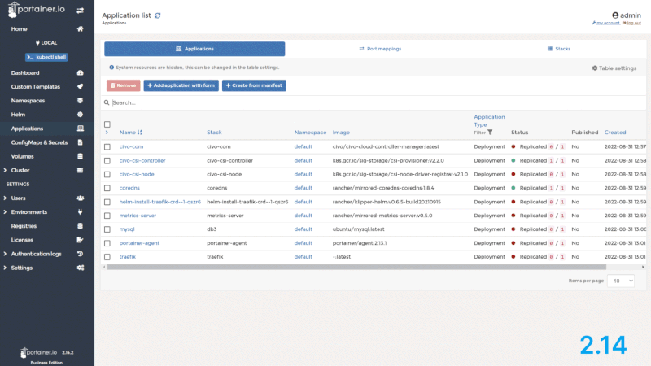
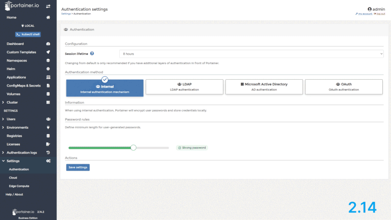
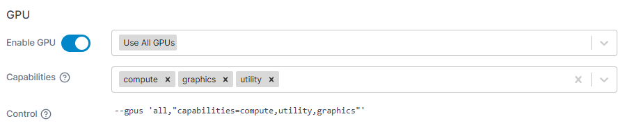
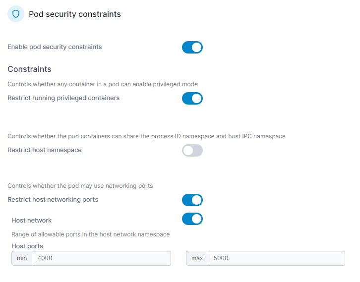
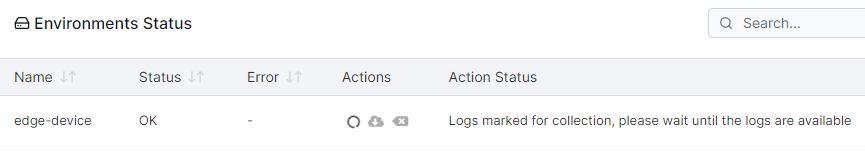
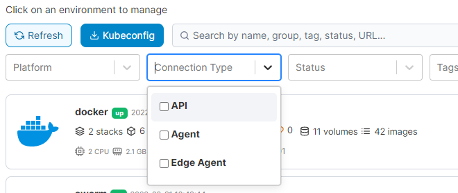
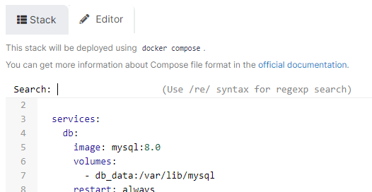

# What's new in version 2.15

Portainer version 2.15 includes a number of new features, fixes and updates. For a full list of changes, please refer to our [release notes](release-notes.md).

## New Features

### New look UI 

The first thing you'll see when using 2.15 is that things look a bit different. Our design and frontend teams have been working hard to make the UI more organized across the board, with a modern, more consistent style and behavior, so that we can make it easier for you to learn, use, and master Portainer.

<figure><figcaption>
The Portainer home page
</figcaption></figure>

 

<figure><figcaption>
Adding a registry
</figcaption></figure>

While this is a big change, we've made sure to keep most things where they are, so you won't have trouble using Portainer with the new look.&#x20;

<figure><figcaption>
Listing your applications
</figcaption></figure>

 

<figure><figcaption>
Setting up authentication
</figcaption></figure>

This is the first step of many UI improvements that are on the way, so keep an eye out for those in future releases. We'd also love to get your feedback on the new look, so let us know what you think.

### GPU support for Docker 

2.15 brings support for GPUs to our Docker implementation. Now using Portainer you're able to attach GPUs to containers to take advantage of their processing power for workloads like machine learning. You can [make GPUs available to your environments](admin/environments/add/docker.md) and then [select the GPUs to attach to a container](user/docker/containers/advanced.md#gpu) and configure the capabilities you require.

<figure><figcaption></figcaption></figure>

At the moment this is only available to [Docker Standalone](start/install/agent/docker/) installations, but we're hoping to expand this to other platforms in the future.

It's also worth noting that much of this particular feature came about because of a community contribution to Portainer, so if you'd like to see a feature in an upcoming version and you have some development skills, have a look at how you can [contribute to Portainer](contribute/contribute.md).

### Kubernetes per-environment security constraints 

When you're sharing an environment between teams, you might want to restrict the access each pod has to limit risks. In Kubernetes you can achieve this using pod security policies, and now with 2.15 you can [apply and manage these policies](user/kubernetes/cluster/security.md) directly in Portainer. For example, you can restrict running containers as privileged, define the allowed host ports, volume types, file system paths, and much more.

<figure><figcaption></figcaption></figure>

Policies are applied on a per-environment basis using the popular and trusted [Open Policy Agent](https://www.openpolicyagent.org/) engine using the [OPA Gatekeeper](https://github.com/open-policy-agent/gatekeeper), which Portainer will install and configure for you if it doesn't already exist.

## Notable changes and fixes

### Improved Edge Agent async functionality 

There's more improvements to our [async functionality](admin/settings/edge.md#deployment-sync-options) for Edge Agents in 2.15. You're now able to list the containers and their running status for Edge Stacks within Portainer, as well as get log files for your [Edge Stacks](user/edge/stacks.md).

<figure><figcaption></figcaption></figure>

### Nomad live browsing 

In 2.15 we've extended our [Nomad support](user/nomad/) further by adding live browsing of your Nomad environment in Portainer. Before this, your view in Portainer was based on the latest snapshot and not live data, but now in 2.15 you're seeing up to date information in the UI while the tunnel between the Nomad Edge Agent and the Portainer Server is open.

### New image notification for private registries 

2.14 added the new image notification feature for public registries, which has been hugely popular. In 2.15 we've expanded this feature to cover private repositories as well, so as long as Portainer knows how to [connect to your registry](admin/registries/) you'll be able to see at a glance whether your containers are running up to date images.

### More usability improvements 

Along with the new look, we've made some usability changes to the home page. You can now [filter your environments](user/home.md) by connection type, for example Agent, Edge Agent, or API, and you can also see the version of the Portainer Agent running on each environment - a good way to tell if all your environments are running the latest version of the agent.

<figure><figcaption></figcaption></figure>

We've added search to all our Web Editor fields in this release - hit `Ctrl-F` (or `Cmd-F` if you're on a Mac) and you're able to search the contents of the field. The search also supports regular expressions. This also came about from a community contribution.

<figure><figcaption></figcaption></figure>

You can now also [click the version number](user/home.md#build-information) in the bottom left of the Portainer UI to show more details about the version of Portainer you're running. We'll often ask for this when trying to troubleshoot an issue, so we've made it easier for you to find when you need it.

### Dependency updates and Kompose deprecation 

We've updated a number of our third-party dependencies in this release for new functionality and bug fixes. We're also looking at [deprecating our Kompose support](advanced/deprecated.md) in a future release, so if you're using that you might want to look at moving to YAML manifests instead.
