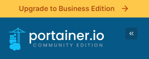
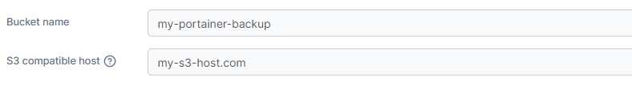
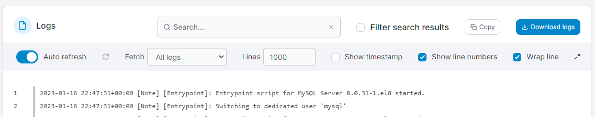
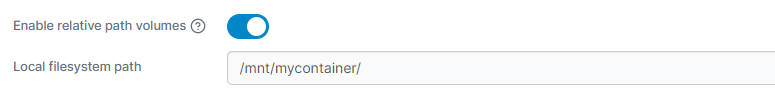
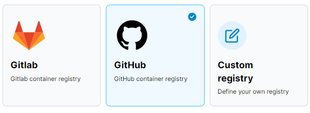
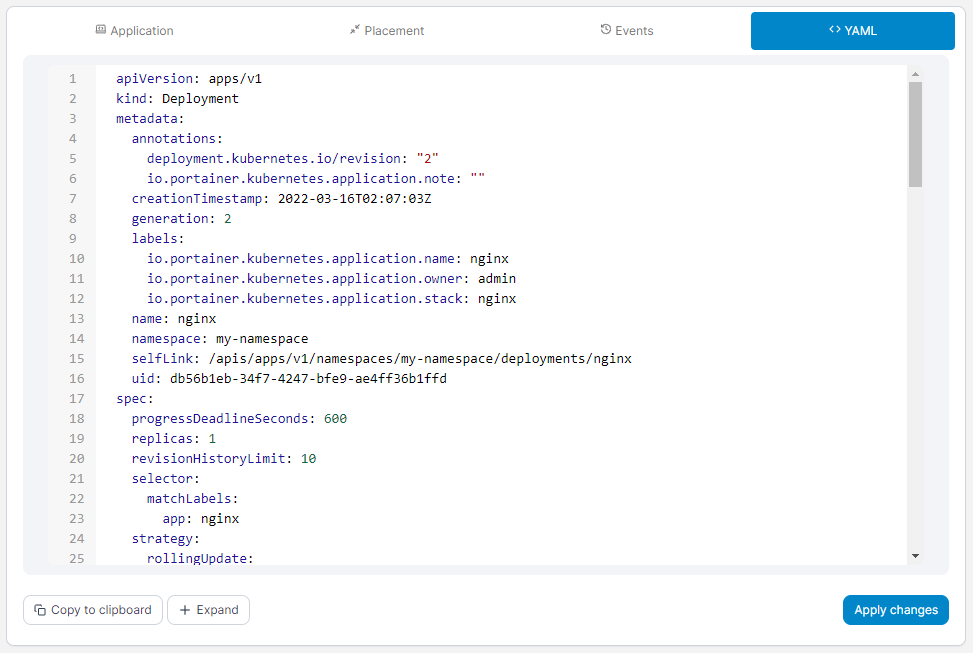
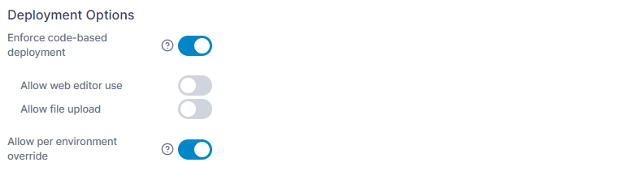
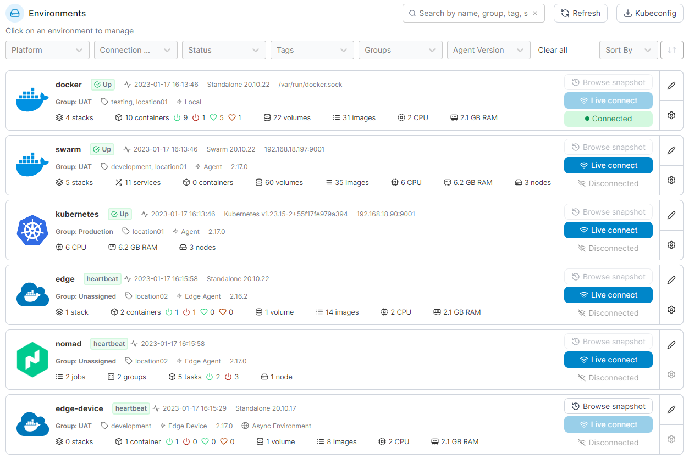
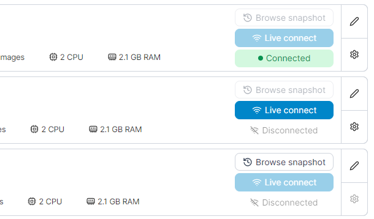
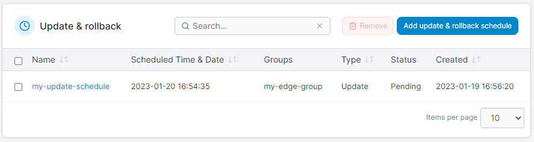

# What's new in version 2.17

Portainer version 2.17 includes a number of new features, fixes and updates. For a full list of changes, please refer to our [release notes](release-notes.md).

## New Features

### Upgrade from CE to BE 

Upgrading from the Community Edition of Portainer to the Business Edition has in the past needed you to jump into the command line and redeploy your Portainer installation, but now in 2.17 you can do this [right from the Portainer UI](start/upgrade/tobe/inapp.md). You can bring your own license key or sign up for a free trial, and Portainer will handle the upgrade for you automatically, getting you up and running on BE without any hassle.

<figure><figcaption></figcaption></figure>

### Back up Portainer to S3-compatible providers 

Portainer Business Edition has long provided the ability to back up your Portainer config to an AWS S3 bucket. In 2.17 we've [expanded this support](admin/settings/#backup-portainer), by popular demand, to S3-compatible providers such as MinIO. As long as your provider is S3-compatible, you should now be able to use them with Portainer.

<figure><figcaption></figcaption></figure>

### Log viewer improvements 

Extending on from updates to the log viewer in our last version, 2.17 brings a refresh of the [log viewer interface](user/docker/containers/logs.md), improving the usability of the viewer as well as the search and filter capabilities, ANSI color support, full screen viewing and more. You'll find this updated interface wherever the log viewer is used in Portainer.

<figure><figcaption></figcaption></figure>

### Relative path support for Git stacks 

Often when deploying a stack you'll want to pre-populate your container's file system from your Git repository into pre-defined relative paths. 2.17 adds support for this with [a toggle on your stack deployment](user/docker/stacks/add.md#relative-path-volumes), letting you spin up a stack and copy the necessary files into directories on your host automatically.

<figure><figcaption></figcaption></figure>

### GitHub Container Registry (GHCR) support 

We've now added the GitHub container registry to our list of supported registry providers in 2.17. This lets you [connect to and browse your GitHub registry](admin/registries/add/ghcr.md) directly from within Portainer, as well as deploy containers from images stored there.

<figure><figcaption></figcaption></figure>

## Kubernetes

### Rolling restart for Kubernetes applications 

In the Kubernetes realm, we've added a [rolling restart](user/kubernetes/applications/inspect.md#actions) option to your deployments. Instead of terminating all your pods and restarting them from scratch when doing an update, you can now instead do a rolling restart of your application, reducing downtime. This is available via the Portainer UI as well as via an option [on your application webhook](user/kubernetes/applications/webhooks.md), which means it can be used in your deployment automation.

<figure><figcaption></figcaption></figure>

### Improved Kubernetes defaults 

We've made some changes to the default [cluster configuration](user/kubernetes/cluster/setup.md) in version 2.17 to more align with sensible standards. This includes automatically detecting new ingress controllers and the presence of the metrics API, as well as auto enabling storage options set as default in the cluster. These apply only clusters that you've newly added to Portainer - your existing clusters won't have their settings changed.

### Direct YAML editing in Portainer 

Since the beginning you've been able to view the YAML for your Kube deployments in Portainer, but in 2.17 you can now make changes to that YAML straight from the UI. Portainer uses the Kubernetes patch mechanism to apply these changes, so if you need to make a quick adjustment to a deployment you can jump straight into the YAML and get it done.

<figure><figcaption></figcaption></figure>

### Enforce code-based deployment 

In 2.17 we've added the option, by popular demand, for cluster admins to [enforce code-based deployment](admin/settings/#deployment-options) on their Kubernetes clusters, disabling the use of the form-based deployment approach. This restriction can be applied globally or on a per-cluster basis. This is to help provide admins with greater control over how applications are deployed and managed on their clusters.

<figure><figcaption></figcaption></figure>

### Enforce admin-only ingress creation 

Along the same vein, 2.17 adds an option to [restrict ingress creation](user/kubernetes/cluster/setup.md#only-allow-admins-to-deploy-ingresses) to admins only. With this option on, non-admin users will still be able to use ingresses configured in the cluster, but won't be able to deploy new ones.

## Edge

### Move Edge Devices to home page 

In the Edge sphere, one of the big changes in 2.17 is moving of Edge Devices to the [home page](user/home.md) view alongside the traditional Portainer environments. This gives you a more unified view of your infrastructure than before, making it easier to use and manage your setup no matter what type it is.

<figure><figcaption></figcaption></figure>

### Browsing async environments 

Now that Edge Devices are on the home page, we've also added the ability to browse Edge devices that are deployed in async mode as you would a traditional environment. You can [browse your environment](admin/settings/edge/devices/#browsing-your-edge-device) as you would any other in Portainer. This is based on the use of snapshots, so what you're seeing will depend on how recent your snapshot is.

<figure><figcaption></figcaption></figure>

### Remote update of Edge Agents 

2.17 also introduces the ability to remotely update your Edge Agent deployments from within Portainer, removing the need to connect to each environment individually when a new version comes out. You can [schedule an update](admin/environments/update.md) across multiple devices at a time that suits you, and Portainer will handle the rest. There are some limitations with this feature at the moment and it is considered a beta, so bear that in mind when trying it out.

<figure><figcaption></figcaption></figure>

### Pre-pull images on Edge devices 

When deploying an Edge stack across a number of devices, you may want to pre-pull your images to the device to make sure they get there before you deploy. In 2.17 we've added the [option to pre-pull images](user/edge/stacks.md#pre-pull-images) on Edge stack deployments, and when enabled Portainer will pull all the needed images to the remote environment and ensure they have been pulled successfully before starting the stack, and will let you know if it wasn't able to do so. This should improve the reliability and stability of your Edge stack deployments.
