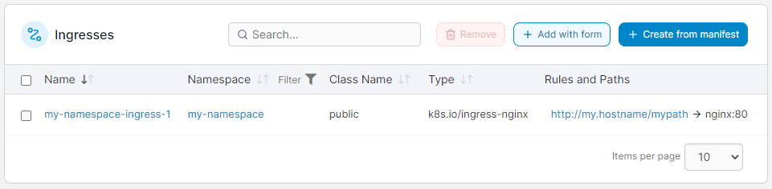
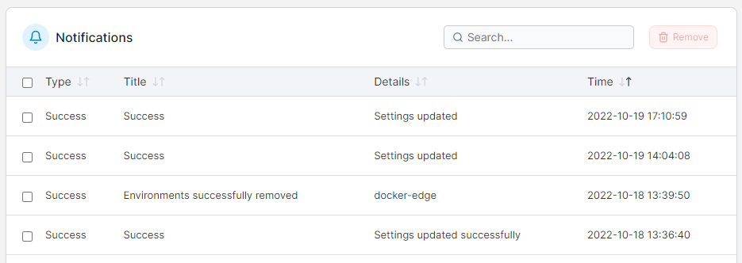
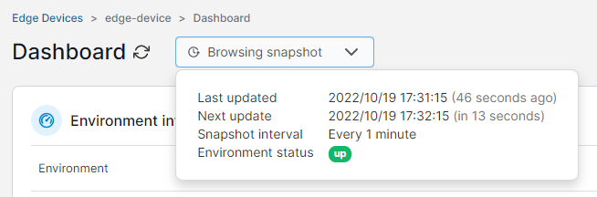
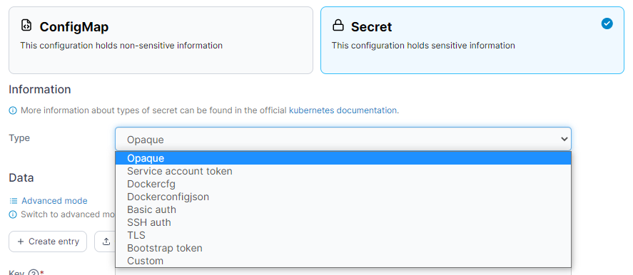
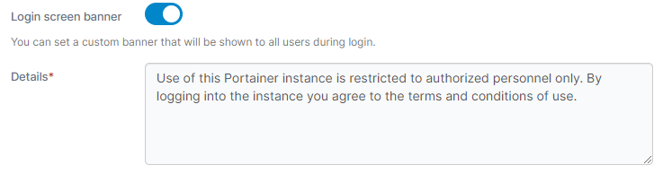

# What's new in version 2.16

Portainer version 2.16 includes a number of new features, fixes and updates. For a full list of changes, please refer to our [release notes](release-notes.md).

## New Features

### Improvements to ingresses 

Ingresses in Kubernetes can be complicated to set up, especially when you consider the different types of ingresses available. In version 2.16 of Portainer we've done a lot of work around our [ingress support](user/kubernetes/ingresses/), adding auto detection of ingress controllers, support for types other than nginx and traefik, as well as support for TLS. We've also moved the setting of hostnames and annotations out of the namespace level, making it easier to configure and manage these for IT admins.

<figure><figcaption></figcaption></figure>

### Git credential support 

If you're deploying your applications from private Git repositories, you might have found it frustrating to have to enter your credentials for each stack or app you deploy. In 2.16 we've added a [Git credential manager](user/account-settings.md#git-credentials), letting you save credentials and use them when adding deployments. These credentials are only available to the user that added them, so there's no issues with other users having access to your creds.

<figure><figcaption></figcaption></figure>

### Notification log 

Sometimes when you do things like deploy a container or make a config change in Portainer, you'll get a notification pop up in the top right corner. In case you miss the notification or you want to go back and see the notifications you've had, we've now added a [notification log](admin/notifications.md) in Portainer Business Edition. You can either select **Notifications** from the left hand menu, or click the bell icon in the top right of any page to see the log.

<figure><figcaption></figcaption></figure>

### Remote commands on async Edge devices 

When you're running your Edge devices in async mode, before now you haven't had the ability to run remote commands on the individual devices. In 2.16 we've [added this functionality](user/edge/devices/#browsing-your-edge-device), letting you browse your device as well as run commands like start, stop, restart, and delete on your containers, stacks and volumes.

<figure><figcaption></figcaption></figure>

## Notable changes and fixes

### Uploading local files when building images 

When you're building a new container image, sometimes you might need to include custom files such as a config file. When building from a Git repository or a tar file you can just include that file along with it, but if you're writing the Dockerfile directly in Portainer you haven't had the option before. In 2.16 we've added the ability to [upload local files](user/docker/images/build.md#method-1-using-the-portainer-web-editor) to use in your image builds. Just click the **Select files** button in the **Upload** section to add your files, then you can reference them in your Dockerfile.

<figure><figcaption></figcaption></figure>

### Logging standardization 

We've made some changes to how we do logging in Portainer in 2.16. In this version, we've moved to using the [zerolog](https://github.com/rs/zerolog#zero-allocation-json-logger) standard for Portainer's logs, as part of larger standardization work we're doing. For the most part this won't affect you much, but this should make it easier to identify issues with your installation.

### Kubernetes secret types 

We've expanded the types of [secrets](user/kubernetes/configurations/) that can be created through Portainer in version 2.16. Before now we only supported the `Opaque` secret type, but we've now got support for the built in secret types as well as the ability to create your own custom type. When you're creating a secret, simply choose the type from the dropdown menu.

<figure><figcaption></figcaption></figure>

### Shared memory size support 

In 2.16 we've added the ability to define the shared memory size for individual Docker containers through the Portainer UI. You can set this through the [Advanced container settings](user/docker/containers/advanced.md) section when creating or editing a container.

### Login screen text 

When you're using Portainer in a larger organization you might have a requirement to display a message to all users at the login screen before they log in. In 2.16 we've [added a field](admin/settings/#login-screen-banner) to let admins set this message through the Portainer UI.

<figure><figcaption></figcaption></figure>

### Context-sensitive help 

On each page of the Portainer UI you'll find a question mark icon in the top right. In 2.16, clicking on this icon will take you to the documentation (right here!) for the page you're currently on, making it easier to find the answers you're looking for. This is the first step of improvements we're making to our in-app documentation, so look out for more of this in future releases.
