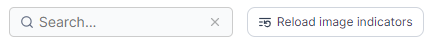
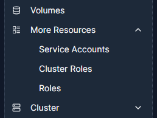
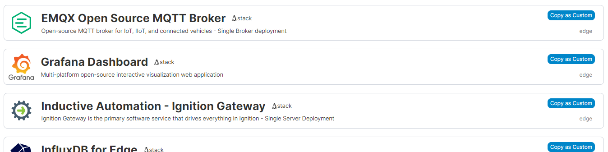
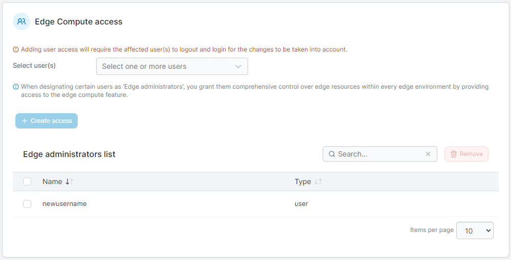
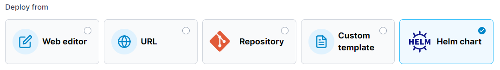

# What's new in version 2.20

Portainer version 2.20 includes a number of new features, fixes, and updates. It also signals the beginning of our new STS and LTS release process. For a full list of changes, please refer to our [release notes](release-notes.md).

## Portainer and STS / LTS

As discussed in the [blog post](https://www.portainer.io/blog/2024-release-principle) from our CEO Neil, we're moving to a new release process for Portainer. In short, we now intend to ship two different types of releases: **Short-Term Support (STS)** and **Long-Term Support (LTS**) releases. Portainer version 2.20 is the first of our Short Term Support releases.

A Short-Term Support release can be considered as "bleeding-edge" as it will contain the latest features and functionality we've developed. The STS releases (including this one) will go through a significant amount of pre-release testing, but there may be changes that could cause regressions and features that might see further iterations. As such, if stability is a crucial concern for your setup we wouldn't recommend deploying STS releases on production environments.

Long-Term Support releases, on the other hand, will not contain new features and will be focused on stability. We'll be taking what we added in the previous STS release, comprehensively testing for issues and regressions, and supplying what we consider production-ready LTS images. The LTS images will be our recommended images, and version 2.21 is planned to be our first LTS release.

As part of this we're also changing the way we tag our images. The `:latest` tag will now only be updated with LTS releases instead of every release. Since 2.20 is a STS release, the `:latest` tag will remain pointing to 2.19.4.

### How do I deploy 2.20 STS on my environment?

To deploy 2.20, you will need to use the version-specific `:2.20.0` tag. As above. `:latest` will remain pointing to 2.19.4 so you'll want to adjust your commands accordingly. For specific instructions on installing or upgrading Portainer on your environments, refer to our documentation.

When you do upgrade to 2.20 however, make sure you take a backup first! If you run into issues and need to drop back to 2.19.4, you'll need this to restore your installation, so note any changes you make to your setup if rolling back.

### Feedback encouraged

Lastly, we want your feedback on this release! Releasing 2.20 as a STS release lets you get in there, test out the changes, and let us know your thoughts on them. The more feedback we have on 2.20, the better our 2.21 LTS release will be, so if you run into any issues or have any thoughts about the new features, get in touch through our normal feedback channels: [GitHub issues](https://github.com/portainer/portainer/issues), [discussions](https://github.com/orgs/portainer/discussions), and for our commercial customers [via our success team](https://www.portainer.io/get-support-for-portainer).

Now that we have that covered, let's talk about what's new in 2.20!

## New Features

### New menu structure  

The first change you're likely to notice in 2.20 is an update to the menu structure within Portainer. In order to streamline the user experience for people that are new to containerization, as well as those more experienced, we've updated the names of some menu items, moved others into new subsections, and generally made it easier to understand where to find the functionality you're after. This is particularly evident for Kubernetes environments, but applies to Portainer as a whole as well.

### More performance improvements  

Our ongoing efforts to improve the performance of Portainer continue in this release. Along with the updated menu structure we have implemented additional caching to improve page load times as well as moved more of our pages and page components to the React framework. We've also added more background population of page contents so that rendering the crucial information comes first with additional longer to retrieve information being loaded asynchronously.

For Kubernetes users, we've added a per-user toggle to [enable front-end data caching for Kubernetes environments](user/account-settings.md#application-settings) that can also help with page load times. This is configurable through the [My account](user/account-settings.md) page.

### Support for streaming Portainer activity and authentication logs to external systems 

When deploying Portainer within your organization you may have the desire or perhaps compliancy need to ship your log files to an external log aggregator. In 2.20 BE we've added the ability to push Portainer's activity and authentication logs in syslog format to an external Security Information and Event Management (SIEM) system without having to write a custom wrapper around the Portainer API.

At present this feature is considered experimental and is [configurable via CLI options](advanced/siem.md), but we're intending to expand this feature further in the future based on customer feedback.

### Buttons to reload image up to date indicators 

Our new image indicator feature has been quite popular since we released it way back in 2.14, and we've made a few adjustments to it in subsequent versions. In 2.20 we've added in buttons on the Containers, Stacks, and Services list pages, as well as the details page for each, that will perform an on-demand reload of the image status for the page you're on.

<figure><figcaption></figcaption></figure>

Image indicators are cached for 24 hours after they are loaded for performance reasons, but with these buttons you can force a check at any time you need one.

### List and manage more Kubernetes object types 

We've expanded the types of Kubernetes objects you can list and manage through Portainer in 2.20. In this version, admins will see new pages for [Service Accounts](user/kubernetes/more-resources/service-accounts.md), [Cluster Roles and Cluster Role Bindings](user/kubernetes/more-resources/cluster-roles.md), and [Roles and Role Bindings](user/kubernetes/more-resources/namespace-roles.md) under the new **More Resources** menu item.

<figure><figcaption></figcaption></figure>

### Enforce admin-only Kubernetes secret viewing in the UI &#x20;

As a cluster administrator you may want to restrict the viewing and editing of secrets within the cluster to administrator users. In 2.20 [we've added a toggle](user/kubernetes/cluster/setup.md#security) that allows you to do just that.

<figure><figcaption></figcaption></figure>

Note that due to limitations within Kubernetes itself, this feature does not hide secrets from viewing through other tools outside of Portainer.

### Templates for Edge &#x20;

Template functionality has existed in Portainer for non-Edge environments for some time, and in 2.20 we're bringing that functionality to Edge Stacks. With Edge Compute enabled, you'll find a new [Edge Templates](user/edge/templates/) option in the left-hand menu. Here you can deploy an Edge Stack from our pre-provided templates, or create and manage your own custom Edge Stack templates for your applications.

<figure><figcaption></figcaption></figure>

Edge Templates support the same functionality as our non-Edge templates, including variables and Git repository deployments, and can also be deployed from the [Create Edge stack](user/edge/stacks/add.md) page.

### New Edge Administrator role 

2.20 also introduces a new [Edge administrator role](admin/settings/edge.md#edge-compute-access) for Edge Compute users. This role lets you give users full control over resources in Edge environments without giving them full administrative access to all of Portainer.

<figure><figcaption></figcaption></figure>

## Enhancements and Fixes

### Updated third-party binaries and libraries  

As we do with every release, we've updated the versions of the third-party binaries and libraries that we use within Portainer to newer versions. This resolves a number of reported CVEs as well as providing improved performance and functionality in some cases.

### Support for new Kubernetes versions  

Along with updated binaries and libraries, we've also updated our Kubernetes version support in 2.20. We now support deploying to Kubernetes 1.27 and 1.28 environments in all cases, and 1.29 where it is available for particular platforms. This is for our supported cloud providers in our KaaS feature, our Kubernetes cluster creation tool for on-premise infrastructure, and for connecting of your existing environments.

### Consolidate Helm functionality into Applications  

As part of our menu restructuring and general usability improvements, in 2.20 we moved the Helm functionality for Kubernetes environments into the Applications system proper, rather than the separate system we had before.

<figure><figcaption></figcaption></figure>

You can now provision applications from Helm charts via the standard [Create from manifest](user/kubernetes/applications/manifest.md) option under [Applications](user/kubernetes/applications/), and Helm deployments will appear in the Applications list alongside other non-Helm deployments. We've also made some improvements to how you can configure and manage your Helm chart repositories within Portainer.

### Allow stopping a Kubernetes app by scaling to 0  

Docker Swarm users have for a long time been able to scale their services to 0, but this wasn't possible in Portainer for Kubernetes deployments. With 2.20, now it is. Scaling a deployment to 0 replicas will result in the application being stopped, and you can then scale it back up at a later date to start it again.

### Added option to disable stacks for Kubernetes  

When deploying an application on Kubernetes, we provide the ability to define a “stack” that your deployment belongs to, which can be useful for grouping deployments. However, this functionality may not always be ideal for everyone’s workflow, so in 2.20 we’ve added the [option to disable stack functionality](admin/settings/general.md#kubernetes-settings) for Kubernetes environments.
