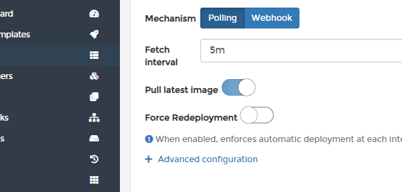
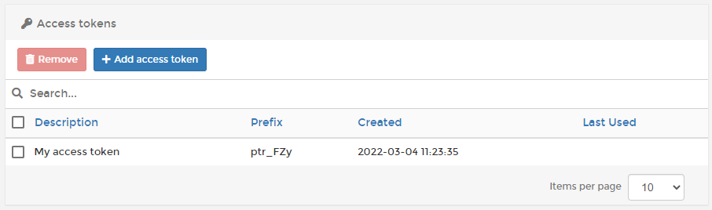
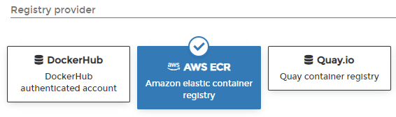
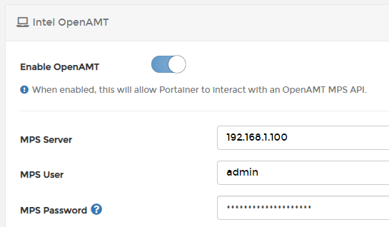
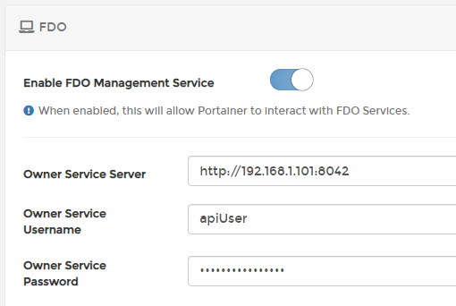
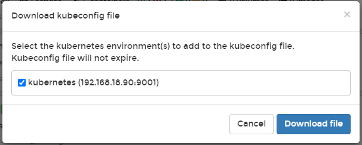

# What's new in version 2.12

Portainer Business Edition (BE) 2.12 includes a number of changes and updates from CE 2.11 as well as some new Business Edition-specific features. For a full list of changes, please refer to our [release notes](release-notes.md).

## New Features

### More improvements to our GitOps engine

In BE 2.10 we added GitOps functionality to Portainer, and in BE 2.12 we've extended this functionality even further. Alongside a number of smaller fixes and improvements, we've added the ability to [specify via a toggle](user/docker/stacks/add.md#automatic-updates) whether the latest version of a container image should be pulled on redeploy.&#x20;

### API access tokens

In CE 2.11 we introduced API access tokens as an alternative to our JWT tokens and this feature is now available in BE 2.12. [API access tokens](user/account-settings.md#access-tokens) are a user-specific token providing API access to Portainer's functionality, based on that user's particular level of access.

You can read more about how to set up and use API access tokens [in our documentation](user/account-settings.md#access-tokens).

### AWS ECR support

BE 2.12 marks the addition of [AWS Elastic Container Registry (ECR) support](admin/registries/add/ecr.md) to Portainer, alongside our existing support for Docker Hub, Quay.io, ProGet, Azure, Gitlab and custom container registries. Users can now deploy images from an ECR registry as well as browse that registry from within Portainer.&#x20;

### Edge: OpenAMT and FDO support

Another CE feature brought across to BE, 2.12 adds support for Intel OpenAMT and FDO technologies to Portainer's Edge Compute functionality.&#x20;

[OpenAMT](user/edge/devices/openamt.md) lets you remotely manage supported physical devices directly from Portainer, including the ability to start, stop and restart the device itself as well as remotely access the device as if you were physically in front of it. If you're familiar with ILO or IPMI, you'll know how useful this can be.

The [FIDO Device Onboard (FDO) protocol](user/edge/devices/fdo.md) lets you create and deploy a device profile to remote bare-metal Edge devices, automating the configuration of the physical device to your specifications without any human interaction. In BE 2.12, this can be done directly from within Portainer.

## Notable changes and fixes

### Role permission updates

After customer feedback we have made some changes to the permissions provided to certain user roles. Most notably, the Standard User role is no longer able to remove or export images. In addition, the Operator, Helpdesk, and Read Only User roles are no longer able to export images. We've also fixed an issue where Standard Users couldn't stop or start containers they should have been able to access.

### Kubernetes: Unified kubeconfig downloads

In BE 2.10 we added the ability to download a kubeconfig file for your individual environments, allowing you to use external tooling to securely access your Kubernetes environment via Portainer while still respecting the permissions afforded to your user. In BE 2.12 we've moved this functionality from being tied to each individual Kubernetes environment (requiring a separate kubeconfig download for each environment) to a [unified download](user/kubernetes/kubeconfig.md) from the Home page.&#x20;

This allows the user to download a single kubeconfig file to access the environments they need without having to manage individual config files.&#x20;

### Edge: Pass local environment variables to Edge Stacks

When a stack is deployed on an Edge device, you may want that stack to refer to environment variables that exist on that remote device - for example, if each device had a "location" label that differed between devices. BE 2.12 adds this functionality.
