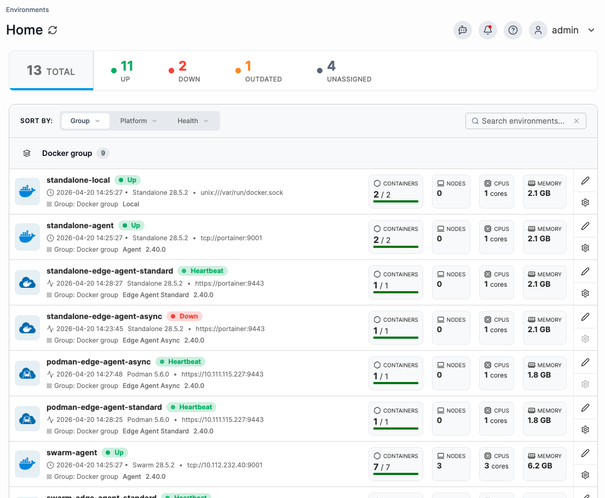

---
metaLinks:
  alternates:
    - https://app.gitbook.com/s/MdgxA76kWxcRmwybM8Ft/whats-new
---

# What's new in version 2.41

Portainer version 2.40 includes a number of new fixes and updates. For a full list of changes, please refer to our [release notes](release-notes.md).

## Short Term Support (STS) 

2.41 is a Short Term Support, or "STS", release of Portainer. STS releases intended to be an introduction of new features and functionality in Portainer, and while we do perform significant testing prior to release are not recommended for production use. For production, we recommend staying with the Long Term Support (LTS) releases. The features that appear in STS releases will, once refined and stable, be implemented in the next LTS release.

You can read more about our release principles in our [lifecycle policy](https://docs.portainer.io/sts/start/lifecycle).

## New in this release

### Manage Portainer using Terraform&#x20;

[Portainer can now be automated](whats-new.md#manage-portainer-using-terraform) using our [official Terraform provider](https://registry.terraform.io/providers/portainer/portainer/latest/docs), allowing you to manage Portainer resources through the Portainer API with Terraform. This lets you create and manage environments, users, teams, stacks, and other Portainer resources as code, and integrate Portainer into your existing Infrastructure as Code and CI/CD workflows.&#x20;

You can find a full walkthrough of how to deploy a Docker stack with Terraform in our [How-to articles](https://www.portainer.io/how-to/how-to-deploy-a-docker-stack-with-terraform).

### A new look for the home page

The Portainer [home page](user/home/) has a new look. As part of our ongoing UI refresh, environments are now displayed in helpful groupings, making it easier to quickly spot environments that are down or not assigned to a group. You can also sort environments by group, platform, or health.

<figure><figcaption></figcaption></figure>
