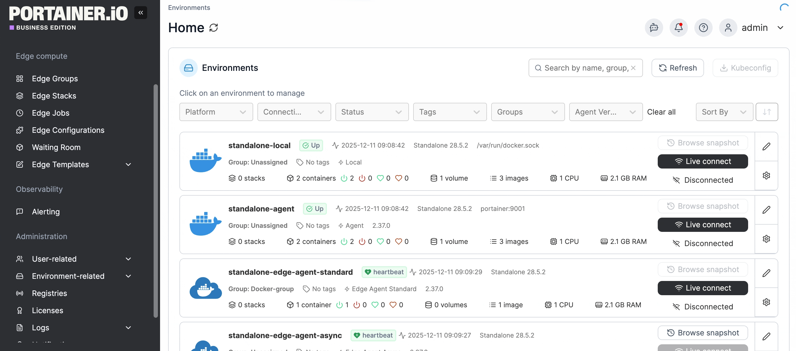

---
metaLinks:
  alternates:
    - https://app.gitbook.com/s/bTMBgpWwhtAF08xfMYTs/whats-new
---

# What's new in version 2.37

Portainer version 2.37 includes a number of new fixes and updates. For a full list of changes, please refer to our [release notes](release-notes.md).

## Short Term Support (STS)

2.37 is a Short Term Support, or "STS", release of Portainer. STS releases intended to be an introduction of new features and functionality in Portainer, and while we do perform significant testing prior to release are not recommended for production use. For production, we recommend staying with the Long Term Support (LTS) releases. The features that appear in STS releases will, once refined and stable, be implemented in the next LTS release.

You can read more about our release principles in our [lifecycle policy](start/lifecycle.md).

## New in this release

### Create centralized policies for Fleet Management 

[Policies](admin/environments/policies/) are now available as part of the experimental Fleet Management feature. After enabling Fleet Management in the settings under [experimental features](admin/settings/general.md#experimental-features), admin users can create centralized policies that apply configuration, security rules, and cluster settings across groups of environments. Eight policy types are available, each designed for specific environment and access needs, with guided forms to help configure the required setup.

<figure><figcaption></figcaption></figure>
